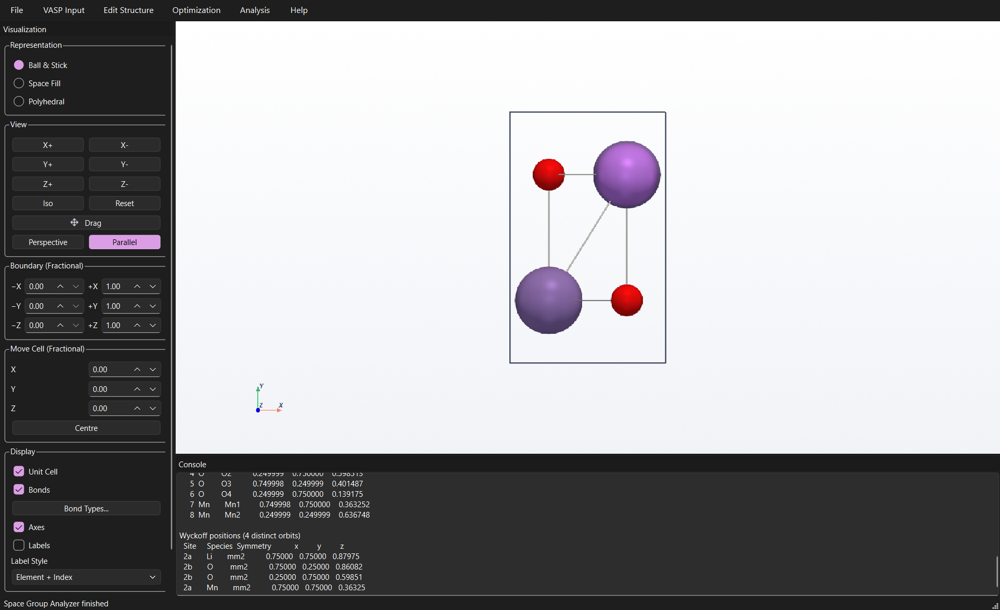
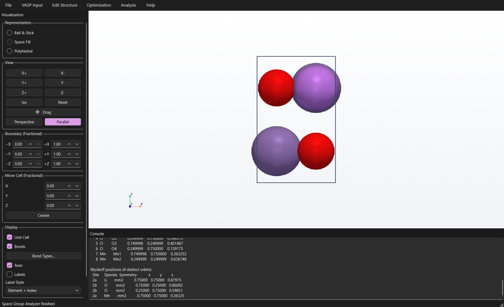
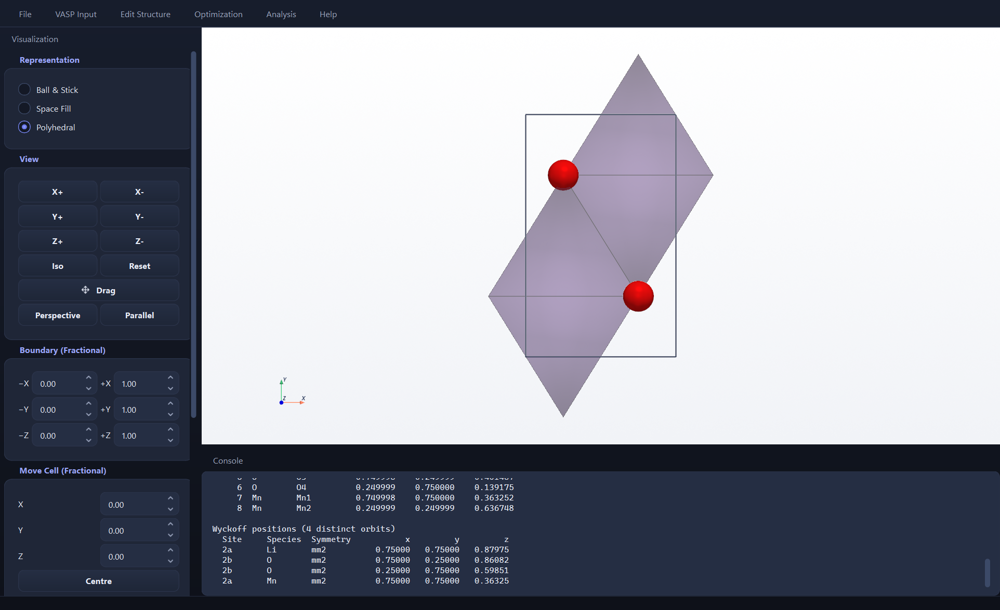
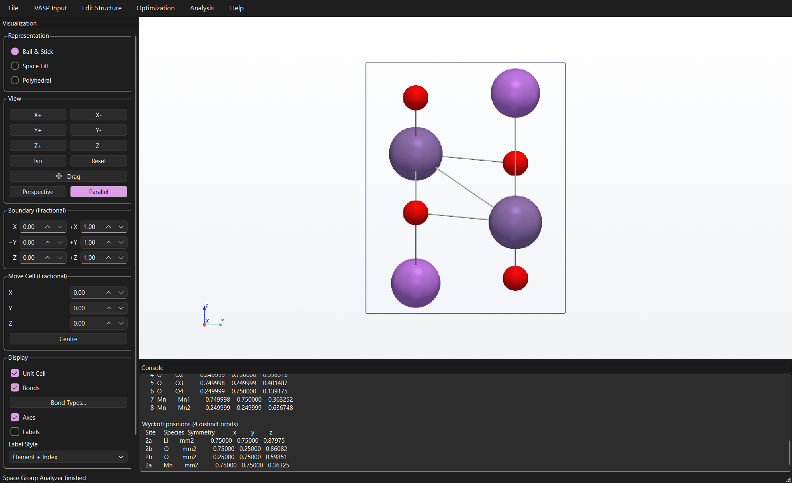
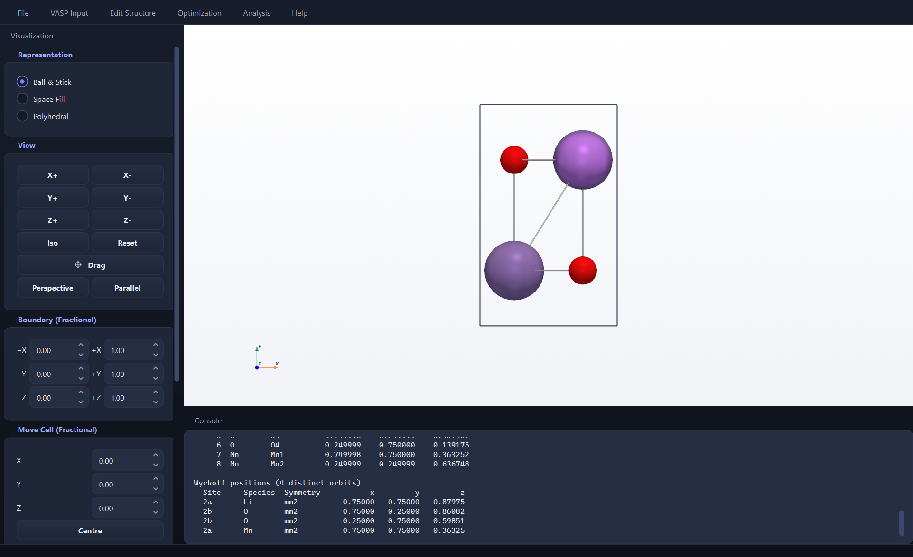
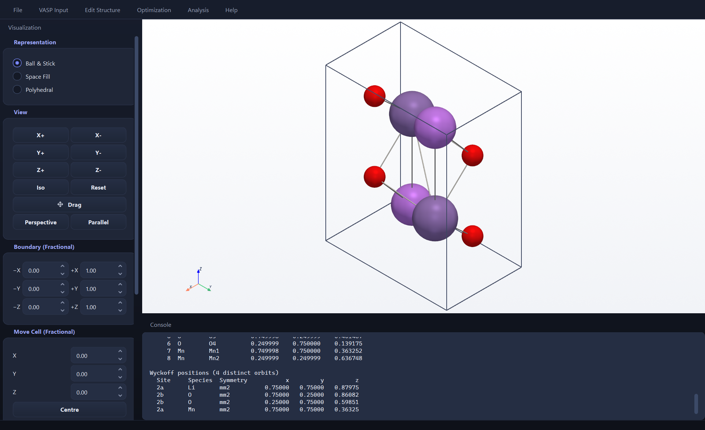
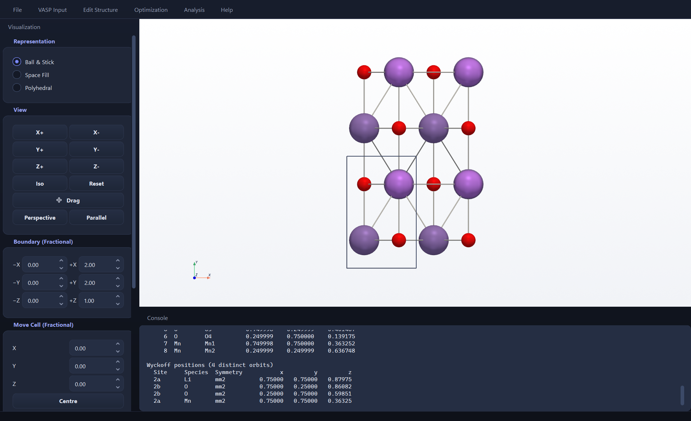

# 1. Opening a structure

Everything else in QVista works on whatever structure is open, so this
is the first step of every workflow.

`File > Open Project`

QVista reads all POSCAR, CONTCAR, CIF, XYZ and `.vasp` files. Choosing one
loads it into the viewport and makes it the current project.


Three things appear at once: the **display panel** on the left, the
**3D viewport** in the middle, and the **console** underneath. The
console is not decoration — it prints the fractional coordinates, the
detected space group and the Wyckoff positions as soon as the structure
loads, which is often all you need to check that the file is what you
thought it was.

---

## What a crystal structure file actually contains

A POSCAR is three pieces of information:

**The lattice vectors** `a`, `b`, `c` — three vectors defining the
parallelepiped that tiles space. Everything about the periodicity lives
here.

**The species and how many of each** — and critically, *the order*.
VASP matches this order to the POTCAR positionally.

**The atomic positions**, given as fractions of the lattice vectors:

```
r_cartesian = x·a + y·b + z·c        with x, y, z in [0, 1)
```

Fractional coordinates are used because they are invariant under
changes of the cell size. An atom at (½, ½, ½) is at the body centre
whether the cell is 3 Å or 30 Å.

---

## The representations

The display panel offers three ways of drawing the same structure, and
each answers a different question.

### Ball and stick



Atoms as small spheres, bonds as cylinders. This is the default because
it shows **connectivity** — what is bonded to what — which is what most
structural questions are about.

Sphere sizes here are scaled covalent radii, chosen so bonds stay
visible.

### Space fill



Each atom drawn at its **van der Waals radius**, the distance at which
the closed-shell repulsion between non-bonded atoms becomes significant.

This shows **how full the cell is** — where the empty space is. That
matters directly for ionic conduction: a migration path exists only if
there is a channel of unoccupied volume connecting two sites. Space fill
makes those channels visible in a way ball-and-stick never can, because
ball-and-stick draws mostly empty space.

Bonds are hidden automatically, since the spheres overlap.

### Polyhedral



Coordination polyhedra — each cation drawn as the solid whose vertices
are its coordinating anions.

This is the crystallographer's view. A layered oxide becomes sheets of
edge-sharing octahedra with the alkali metal between them; a spinel
becomes a framework of corner-sharing tetrahedra and octahedra. Whether
polyhedra share **corners**, **edges** or **faces** controls the
cation–cation distance and hence the electrostatic repulsion, which is
why the same stoichiometry in two different polyhedral arrangements can
have completely different stability.

---

## Looking at it properly

### Standard views

The **X+ / Y+ / Z+** buttons snap the camera down a lattice direction.







Looking down a symmetry direction is not just tidier — it is how you
see stacking sequences, channel openings and layer registry. An
arbitrary angle hides all of it.

### Parallel, not perspective

QVista opens in **parallel** projection. Parallel lines stay parallel,
so distances across the cell are directly comparable and the figure is
measurable. Perspective adds depth cues that help with complicated
polyhedral networks but makes the picture unmeasurable — a bond at the
back is drawn shorter than the same bond at the front.

Use parallel for anything you will publish.

### Periodic images

A unit cell is a tile in an infinite pattern, and drawing only one tile
can be misleading — atoms at the cell edge look under-coordinated
because their neighbours are in the next cell.

The **Boundary** controls extend the drawn region:



Setting `+X` and `+Y` to 2.00 draws a 2×2 block. Now the layer stacking
and the coordination at the boundaries are visible.

**This changes only the picture, not the structure.** The cell itself is
untouched; nothing you compute afterwards is affected.

---

## Bonds are a drawing convention

Bonds are drawn from element-pair distance cutoffs. There is no bond
information in a POSCAR — a crystal structure is a list of positions,
and "bond" is an interpretation laid on top.

```
for each pair of atoms (i, j):
    d = minimum_image_distance(i, j)
    if pair (species_i, species_j) is enabled and d < cutoff(species_i, species_j):
        draw a cylinder from i to j
```

`Bond Types...` opens a panel where each element pair can be switched
off or given its own cutoff.

**This matters chemically.** In a layered cathode such as LiCoO₂, the
Li–O interaction is essentially ionic — Li sits in an octahedral hole
and is not covalently bonded to the framework. Drawing Li–O bonds
produces a picture implying a covalent network that does not exist, and
it obscures the layered structure that makes the material work. Switch
Li–O off and the CoO₂ sheets with Li between them appear immediately.

---

## Selection

Left-click an atom to select it; right-click clears the selection.

Several tools work on the selection — bond-length editing,
electronegativity, atom removal — so a stale selection is the usual
reason one of them appears to do nothing.

---

## Exporting

`File > Export Image` saves the viewport at a chosen format and
resolution. The image is rendered by supersampling, so a 4× export
genuinely has 4× the detail rather than being an upscaled screenshot.

`File > Export Data` writes the structure back out as POSCAR, CIF, XYZ
and other formats.

---

**Next:** [POTCAR](02-potcar.md) — the first of the three VASP input files.
