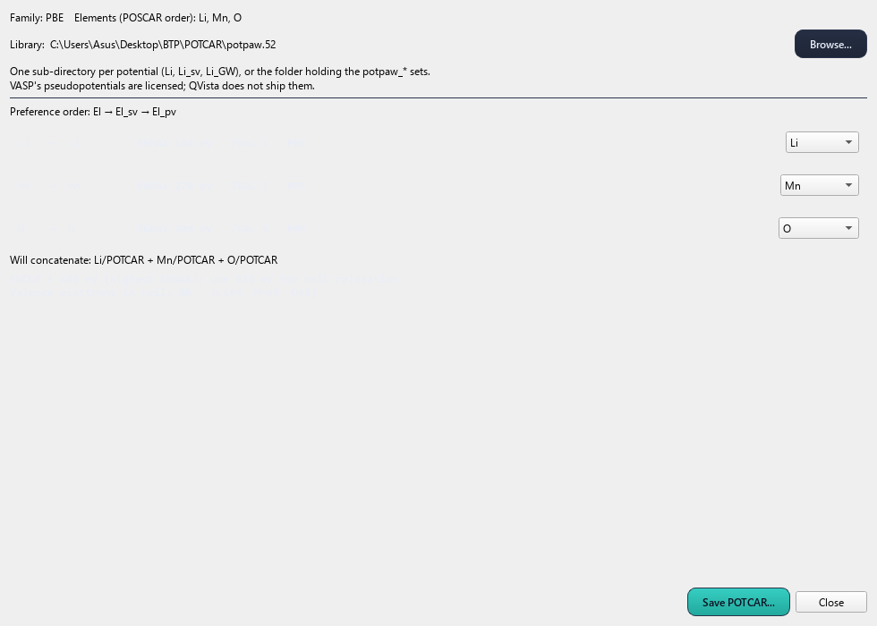

# 2. POTCAR

## Step 1 — point QVista at your pseudopotential library

`File > Set POTCAR Library`

Choose the directory containing `potpaw_PBE/`, `potpaw_LDA/` and so on.
QVista remembers it, so this is a one-time setup.

**QVista does not ship POTCARs.** They are licensed by the VASP
developers and may not be redistributed, so the library must be your own
institutional installation. Nothing named POTCAR is in the QVista
repository, at any depth.

---

## Step 2 — generate the POTCAR

`VASP Input > POTCAR`



QVista reads the elements out of the open structure — **in the POSCAR's
order** — and concatenates the matching pseudopotential files.

---

## The chemistry: what a pseudopotential is

Solving the Schrödinger equation for every electron in a solid is
hopeless and mostly pointless. Core electrons are chemically inert: the
1s of oxygen sits ~500 eV below the valence states and does not
participate in bonding. But core wavefunctions oscillate rapidly near
the nucleus, and representing those oscillations in a plane-wave basis
would need millions of plane waves.

A pseudopotential replaces the nucleus plus core electrons with an
effective potential that reproduces the correct **valence** behaviour
outside a cutoff radius, while being smooth inside it. VASP uses the
**projector augmented wave** (PAW) method, which keeps a formal mapping
back to the true all-electron wavefunction — which is why PAW densities
can be reconstructed for Bader analysis, and norm-conserving ones
cannot.

### The valence choice is a chemical decision

For each element there are variants, and picking the wrong one gives
wrong physics without any error:

| Variant | Treats as valence | Use for |
|---|---|---|
| `Li` | 2s only | Li in simple compounds |
| `Li_sv` | 1s²2s — semicore **s** | Li in oxides, and anything where Li polarises |
| `Mn_pv` | 3p⁶3d⁵4s² — semicore **p** | all 3d transition metals |
| `O` | 2s²2p⁴ | standard |
| `O_h` | harder, needs larger `ENCUT` | when O is under strong compression |

**Transition metals need `_pv`.** With the plain variant the semicore 3p
states are frozen into the core, but in an oxide those states overlap
significantly with O 2p and participate in the bonding. Freezing them
gives wrong magnetic moments, wrong lattice parameters, and wrong
oxidation-state behaviour on delithiation — the exact quantities a
cathode study is about.

QVista shows the recommended variant for each element.

---

## Why the order is the whole point

VASP matches POTCAR blocks to POSCAR species **by position**. It does
not check the names.

```
POSCAR species line:   Li   Mn   O
POSCAR counts line:     4    4    8

POTCAR must be:        [Li block][Mn block][O block]
```

If the POTCAR is assembled in a different order, VASP runs perfectly
happily and treats your lithium as manganese. Every energy, force and
charge is wrong, nothing warns you, and the output looks completely
normal.

QVista takes the order from the structure, so this class of error cannot
happen by hand-assembly:

```
elements, counts = species_in_poscar_order(structure)

for element in elements:                    # order preserved
    variant  = user_choice[element]         # e.g. Mn -> Mn_pv
    block    = read(library / family / variant / "POTCAR")
    append block to output

report max(ENMAX for each block)
```

---

## ENMAX and your ENCUT

Each pseudopotential declares an `ENMAX` — the plane-wave cutoff it was
designed for. QVista reports the largest across the elements you chose.

Your `ENCUT` in the INCAR must be **at least** that, and convention is
to use 1.3 × the largest for anything involving stress or cell
relaxation, because the plane-wave basis is incomplete and the resulting
Pulay stress is systematic:

```
ENCUT ≥ max(ENMAX)                 for fixed-cell calculations
ENCUT ≈ 1.3 × max(ENMAX)           for cell relaxation and elastic constants
```

Oxygen usually sets the limit — it is a hard element with a compact 2p
shell, so an oxide typically needs 520–600 eV even though the metal
alone would be happy at 300.

**Comparing two calculations at different `ENCUT` is meaningless.** The
basis-set error does not cancel. Every structure in a comparison — an
energy difference, a formation energy, a barrier — must use the same
cutoff and the same pseudopotentials.

---

**Next:** [INCAR](03-incar.md) — the settings for each job type.
