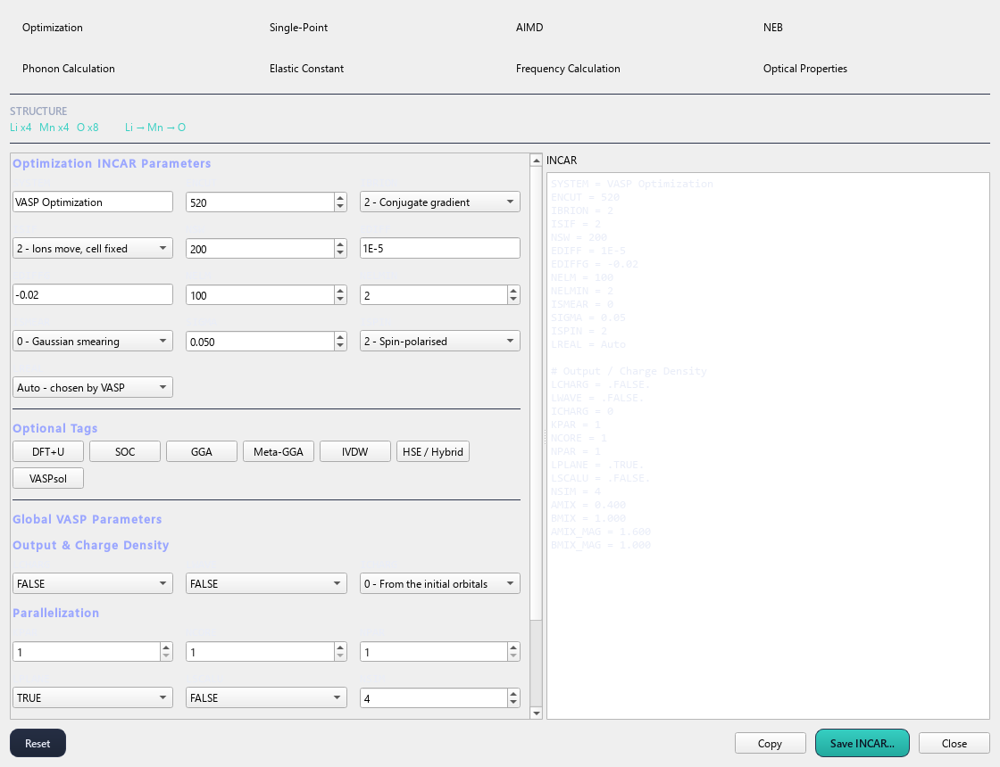

# 3. INCAR

> **This page has moved.** The tutorial now lives inside the QVista
> repository, and this copy is archived and no longer updated. The
> current version of this page is
> [here](https://github.com/CMCLAB-IITG/QVista/blob/main/docs/tutorial/03-incar.md).

`VASP Input > INCAR`

The INCAR tells VASP *what calculation to do*. QVista organises it by
**job type** — you pick what you are running, and only the tags that job
needs are shown.

---

## Optimization



Move the atoms (and optionally the cell) downhill until the forces
vanish. The result is a local minimum of the potential energy surface.

### The chemistry

DFT gives you the energy `E({R})` for a fixed set of nuclear positions,
and its gradient — the force on each atom:

```
F_i = -∂E/∂R_i
```

A relaxation follows those forces downhill. What you get is the nearest
minimum, **not the global one**. A structure relaxed from a bad starting
guess lands in whatever basin it started in, which is why the starting
geometry matters and why [CHGNet pre-relaxation](05-optimization.md) is
useful.

### ISIF — the tag most often set wrong

| `ISIF` | Ions | Cell shape | Cell volume |
|---|---|---|---|
| 2 | yes | no | no |
| 3 | yes | yes | yes |
| 4 | yes | yes | no |
| 7 | no | no | yes |

**`ISIF = 3`** for a bulk structure whose lattice parameters you want.

**`ISIF = 2`** for anything where the cell must stay put:

- a **slab**, where relaxing the cell would compress the vacuum
- a **defect cell**, where the point is to compare against the perfect
  cell at the same volume
- an **NEB endpoint**, because a band has one cell and two endpoints
  relaxed with free cells will not agree

Getting this wrong is not an error, it is a wrong answer. A vacancy
formation energy computed with `ISIF = 3` on the defect cell and
`ISIF = 3` on the perfect cell compares two different volumes.

### Convergence

```
EDIFF   = 1E-6      electronic loop, eV
EDIFFG  = -0.02     ionic loop: negative = force criterion, eV/Å
```

`EDIFFG` negative means "stop when no force exceeds this". Positive
means "stop when the energy change is below this", which is weaker — a
structure can satisfy an energy criterion while still carrying large
forces, because the energy surface is flat near a minimum while the
forces are not.

Use a force criterion. `-0.02` eV/Å is normal; `-0.01` for phonon
starting geometries, where residual forces become imaginary modes.

### Cell relaxation needs a rerun

Changing the cell changes which plane waves fit in it, but VASP fixes
the basis at the start. After an `ISIF = 3` relaxation the basis no
longer matches the cell, so **restart from the CONTCAR and run again**
until the geometry stops moving. Two or three rounds is typical.

---

## Single point — for DOS and charge analysis


One self-consistent field calculation on a fixed geometry.

```
IBRION = -1        do not move anything
NSW    = 0         no ionic steps
LORBIT = 11        write projected DOS to DOSCAR and PROCAR
LCHARG = .TRUE.    write CHGCAR
LAECHG = .TRUE.    write AECCAR0 and AECCAR2  (Bader needs these)
LWAVE  = .TRUE.    write WAVECAR              (LOBSTER/COHP needs this)
```

**Set the output flags before you run.** `LAECHG` and `LWAVE` cannot be
recovered afterwards — if you forget them, the Bader or COHP analysis
means running the whole SCF again. QVista keeps these on automatically
when you pick a job type that needs them.

### The SCF cycle, in outline

```
guess an electron density n(r)
repeat:
    build the effective potential  V_eff[n]
    solve  (-½∇² + V_eff) ψ_i = ε_i ψ_i
    n_new(r) = Σ_occupied |ψ_i(r)|²
    mix n_new with n            # mixing is what makes this converge
until |E_new - E_old| < EDIFF
```

The self-consistency is the point: the potential depends on the density,
which depends on the orbitals, which depend on the potential.

### Smearing

`ISMEAR` decides how partial occupancies near the Fermi level are
handled, and the right choice depends on whether the material is a
metal:

| | |
|---|---|
| `ISMEAR = 0`, `SIGMA = 0.05` | Gaussian — safe default, works for anything |
| `ISMEAR = -5` | tetrahedron — **best for a DOS**, needs ≥ 4 k-points |
| `ISMEAR = 1` or `2` | Methfessel-Paxton — for metals, relaxations |

Use `-5` for the final DOS run. Using a metallic smearing on a
semiconductor puts spurious occupancy across the gap and smears the band
edges.

---

## Band structure

A band structure is a **two-step** calculation, and this is the single
most common thing people get wrong.

```
step 1   SCF on a regular k-mesh     -> converged CHGCAR
step 2   non-SCF along a k-path      -> EIGENVAL with the band structure
         ICHARG = 11                 # read the density, do not update it
```

Step 2 must be non-self-consistent. A set of lines through the
Brillouin zone does not sample it well enough to converge a density; run
it self-consistently and you get a converged-looking calculation with a
meaningless density.

The k-path itself comes from [Symmetry and k-paths](06-symmetry.md).

---

## Phonons


Phonon frequencies are **second** derivatives of the energy, so they
amplify every error in the forces.

```
EDIFF  = 1E-8      much tighter than a relaxation
IBRION = -1
NSW    = 0
ISMEAR = 0, SIGMA = 0.01
```

The finite-displacement method computes the force constant matrix by
moving one atom and measuring the forces on all the others:

```
Φ_ij = -∂F_j / ∂u_i  ≈  -[F_j(+u_i) - F_j(-u_i)] / 2u
```

with `u` ≈ 0.01 Å. The force difference from a 0.01 Å displacement is
small, so an `EDIFF` of `1E-6` leaves noise comparable to the signal,
and the noise appears as imaginary modes. This is the usual cause of
"my structure has imaginary phonons" when the structure is in fact fine.

The **starting geometry must be tightly relaxed too** — residual forces
in the reference structure contaminate every force constant.

---

## Molecular dynamics


```
IBRION = 0         molecular dynamics
POTIM  = 2         timestep, fs
NSW    = 10000     number of steps
NBLOCK = 1         write a frame to XDATCAR every NBLOCK steps
```

The ensemble comes from `MDALGO` and `SMASS` — VASP never writes "NVE"
or "NVT" anywhere:

| Setting | Ensemble |
|---|---|
| `SMASS = -3` | NVE, no thermostat |
| `MDALGO = 2` | NVT, Nosé-Hoover |
| `MDALGO = 3` | NVT, Langevin |

### Choosing the timestep

The timestep must resolve the fastest vibration in the system. A typical
metal–oxygen stretch is ~20 THz, a period of ~50 fs, so 2 fs gives ~25
points per period. Hydrogen vibrates at ~100 THz and needs 0.5 fs.

Too long a timestep shows up as **energy drift in NVE**. QVista reports
the drift per atom, and a drift above ~1 meV/atom means halve the
timestep.

### NBLOCK matters later

The gap between XDATCAR frames is `POTIM × NBLOCK`. A diffusion
coefficient computed as though the gap were `POTIM` alone is wrong by
exactly the factor `NBLOCK`, and nothing about the MSD curve looks
wrong. QVista reads `NBLOCK` from the INCAR to get this right.

---

## DFT+U for transition-metal oxides

Standard DFT badly underestimates the band gap of transition-metal
oxides and over-delocalises d electrons — a Mott insulator like NiO
comes out metallic.

DFT+U adds a Hubbard penalty for fractional d occupancy, pushing
occupied d states down and empty ones up:

```
E_U = (U - J)/2 · Σ_σ Tr[ρ_σ(1 - ρ_σ)]
```

In VASP's Dudarev scheme, only the **difference** `U − J` is
meaningful. QVista asks for the effective `U` and writes `LDAUU` and
`LDAUJ` per element, in the POSCAR's order — the same positional match
as the POTCAR.

Typical effective `U`: Mn 3.9, Fe 5.3, Co 3.3, Ni 6.2 eV. These are
fitted values, not physical constants, and the fitted quantity matters:
a `U` fitted to reproduce formation energies is not the one that
reproduces band gaps. Quote your source.

---

**Next:** [KPOINTS](04-kpoints.md) — sampling the Brillouin zone.
