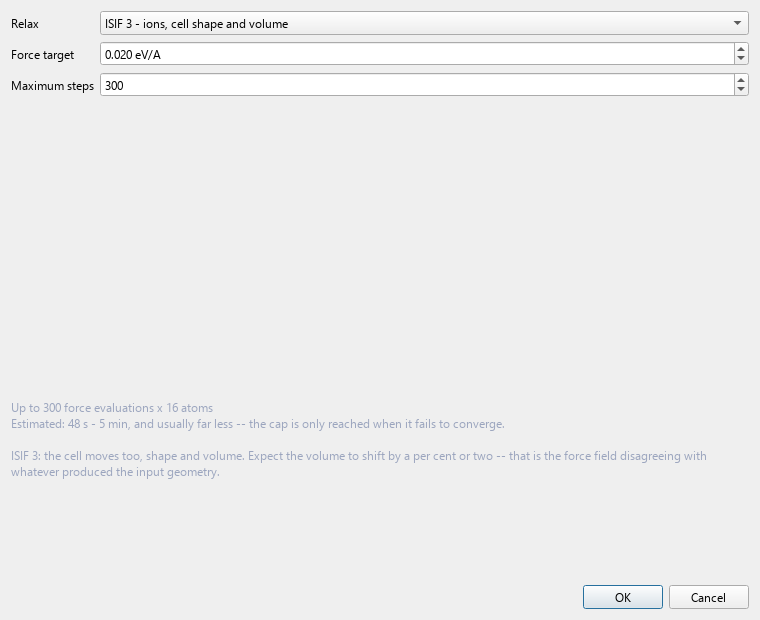

# 5. Optimisation with CHGNet

`Optimization > CHGNet`



Relax the open structure with a machine-learning interatomic potential
instead of VASP. Seconds to minutes, on your laptop, no queue.

---

## What CHGNet actually is

CHGNet is a **graph neural network** trained on the Materials Project
trajectory dataset — roughly 1.5 million DFT relaxation steps across
~150,000 inorganic crystals. It takes a structure and returns energy,
forces and stress, the same three things VASP returns:

```
graph = build_graph(structure, cutoff = 5 Å)

    nodes = atoms, embedded by species
    edges = pairs within the cutoff, embedded by distance

for each message-passing layer:
    each atom updates its state from its neighbours' states

E     = Σ_atoms  readout(atom state)
F_i   = -∂E/∂R_i          # by automatic differentiation, not finite difference
σ     = -(1/V) ∂E/∂ε
```

Two things are worth understanding about this.

**The forces are exact derivatives of the predicted energy.** They come
from automatic differentiation through the network, so the forces and
energy are consistent with each other — a relaxation cannot drive the
structure somewhere the energy disagrees with. This is not true of
force fields whose forces are fitted separately.

**CHGNet also predicts magnetic moments**, which is unusual and is why
it does comparatively well on transition-metal oxides — the model has
some representation of the oxidation state rather than treating an atom
as just its element.

---

## The relaxation

```
attach CHGNet as the calculator
optimiser = FIRE(structure)          # or L-BFGS

repeat:
    E, F = calculator(structure)
    move atoms along F               # and strain the cell, if enabled
until max|F_i| < fmax  or  step limit reached
```

### Settings

| | |
|---|---|
| **fmax** | force convergence, eV/Å. `0.05` is a reasonable default |
| **Max steps** | cap, so a pathological structure does not run forever |
| **Relax cell** | whether the lattice vectors move too |

**Relax cell** is the same decision as `ISIF` in VASP: on for a bulk
structure whose lattice parameter you want, off for a slab, a defect
cell, or an NEB endpoint.

---

## What this is genuinely good for

**Cleaning up a starting structure.** A hand-built structure, or one
from a database, or one you made by substituting an element, usually
starts far from any minimum. Letting CHGNet take it most of the way
means the DFT relaxation starts close and converges in a fraction of
the ionic steps. On a large cell that can be the difference between a
day and a week of cluster time.

**Screening.** If you are looking at fifty candidate compositions, relax
all fifty here and take the promising ones to DFT.

**Sanity-checking.** A structure that CHGNet relaxes into something
completely different was probably wrong to begin with.

**Feeding a supercell.** Phonon and NEB workflows both need a
well-relaxed starting point, and both are expensive; getting there
cheaply first is worthwhile.

---

## What it is not

**It is not DFT.** The accuracy is the accuracy of the training set and
how well your material is represented in it. Reported errors are around
30 meV/atom on energy and 0.07 eV/Å on forces for typical inorganic
crystals — good enough to find the right basin, not good enough to
resolve a 20 meV energy difference between two polymorphs.

It is least reliable exactly where materials chemistry is most
interesting:

- **surfaces and interfaces** — under-represented in a bulk training set
- **unusual oxidation states** or coordination
- **strongly correlated systems** where even DFT needs `+U`
- **anything far from the training distribution**, and the model will
  not tell you it is extrapolating

**Always re-relax with VASP before quoting a geometry or an energy.**
Use CHGNet to get there faster, not to avoid getting there.

---

## Reading the result

QVista reports the initial and final energy, the maximum force at each
step, and whether it converged. The structure in the viewport updates,
and you can export the relaxed geometry as a POSCAR to start the DFT
run from.

A relaxation that hits the step limit without converging usually means
one of:

- the structure was very far from a minimum (fine — restart from the
  result)
- there is a genuinely soft mode and the structure is unstable (check
  with [phonons](09-phonons.md))
- `fmax` is tighter than the model's own force noise, around 0.01 eV/Å

---

**Next:** [Symmetry and k-paths](06-symmetry.md) — check what you have
after relaxing.
