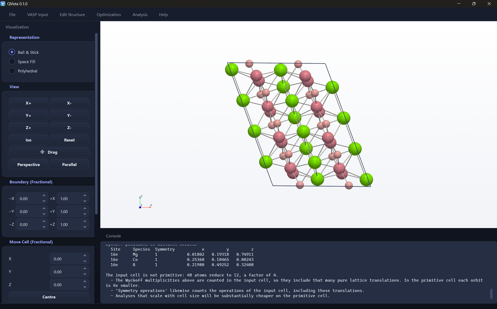

# 6. Symmetry and k-paths

> **This page has moved.** The tutorial now lives inside the QVista
> repository, and this copy is archived and no longer updated. The
> current version of this page is
> [here](https://github.com/CMCLAB-IITG/QVista/blob/main/docs/tutorial/06-symmetry.md).

Two entries under `Analysis > Crystallography`, and they belong
together: the space group determines which k-path is meaningful.

---

## Space Group Analyzer

`Analysis > Crystallography > Space Group Analyzer`

The result prints straight into the console, which is visible at the
bottom of the window:



You get the space group symbol and number, the point group, the Wyckoff
positions of every site, and the conventional and primitive cells.

---

## The chemistry: what a space group is

A crystal's symmetry is the set of operations that map it onto itself.
Each is a rotation or reflection combined with a translation:

```
r  ->  R·r + t
```

- `R` is a point operation — rotation, mirror, inversion, rotoinversion
- `t` is a translation, either zero or a fraction of a lattice vector

Operations with a non-zero fractional `t` are **screw axes** and **glide
planes**, and they are why there are 230 space groups rather than the 32
point groups.

### Wyckoff positions

A **Wyckoff position** is an orbit of sites that the symmetry operations
map among themselves. Every site in one orbit is crystallographically
identical — same local environment, same energy, same everything.

This is enormously useful:

- **Only one atom per orbit is independent.** A structure with 8 atoms
  in 4 orbits has 4 distinct environments, not 8.
- **A phonon calculation only needs to displace one atom per orbit**,
  in the symmetry-inequivalent directions. This is what makes phonons
  affordable at all.
- **Substitution has fewer distinct outcomes than it looks.** Doping one
  of 8 Li sites gives 4 distinct structures, not 8.
- **Site multiplicity gives stoichiometry directly** — reading `2a` and
  `4f` off the analysis tells you the formula unit.

In the screenshot above, the console reports 4 distinct orbits for the
8-atom cell, each with site symmetry `mm2`.

---

## The tolerance is half the answer

Symmetry detection needs a numerical tolerance, `symprec`, and **the
answer changes with it**.

A relaxed structure never has exact symmetry — atoms sit fractions of a
picometre off ideal positions because the optimiser stopped at a finite
force. So "what is the space group" is only answerable once you say how
close counts as equal.

```
for symprec in [1e-5, 1e-4, 1e-3, 1e-2]:
    group = detect_space_group(structure, symprec)
    report symprec, group
```

Reading the result:

- **Same group across the whole range** → the structure genuinely has
  that symmetry.
- **Jumps from `P1` to something high** → the structure is distorted,
  and *where* it jumps measures how distorted. A jump at `1e-3` means
  displacements of about a milliangstrom; a jump at `1e-1` means the
  structure is genuinely a different, lower-symmetry phase.

**Reporting a space group without the tolerance is reporting half a
result.** The default `1e-5` is strict — relaxation noise routinely
needs `1e-3`.

### Why it matters downstream

Symmetry controls the cost of everything:

| | |
|---|---|
| **k-points** | VASP reduces the mesh to the irreducible wedge. Higher symmetry, fewer points, cheaper. |
| **Phonons** | the number of displacements is set by the inequivalent orbits and directions |
| **Band paths** | the standard path is defined per lattice type |

A relaxation that silently broke your symmetry — because it drifted into
a slightly distorted structure — multiplies the cost of everything after
it. Check the space group after relaxing, not just before.

---

## High Symmetry Pathway

`Analysis > Crystallography > High Symmetry Pathway`

Derives the standard Brillouin-zone path for your lattice and writes the
line-mode `KPOINTS`.

### Why particular points

High-symmetry points are where the little group — the set of operations
leaving **k** invariant — is larger than elsewhere. Physically that means
degeneracies are enforced there, and band extrema very often sit at them:

| Point | Location | |
|---|---|---|
| **Γ** | (0,0,0) | zone centre; almost always sampled |
| **X**, **M**, **R** | face, edge, corner centres (cubic) | common band extrema |
| **K**, **M** | hexagonal zone | the Dirac point of graphene is at K |

A band structure is a path through the zone connecting these, chosen so
that all the important extrema lie on it. The convention QVista follows
is Setyawan–Curtarolo, via `seekpath`, so an orthorhombic cell gets
Γ–X–S–Y–Γ–Z rather than a path borrowed from a cubic example.

```
lattice_type = classify(structure, symprec)     # cubic, hexagonal, ...
points       = standard_labels(lattice_type)    # Γ, X, M, ... with coordinates
path         = standard_path(lattice_type)      # the recommended sequence

for each segment (A, B) in path:
    write N interpolated k-points from A to B

write KPOINTS in line mode
```

### The mistake to avoid

**The path is defined for the primitive cell in a standard setting.**

If your POSCAR is a conventional cell, a supercell, or in a non-standard
setting, the labels will not correspond to the zone you think you are
sampling — you will get a band structure with correct-looking labels and
wrong physics.

Run the Space Group Analyzer first and use the **primitive cell** it
reports.

A supercell is worse than wrong: folding a band structure into a smaller
zone maps many bands onto the same k-point, producing a dense tangle
that is technically correct and completely unreadable.

### Points per segment

Enough to resolve the curvature. 20–50 per segment is normal. Too few
makes a band edge look like a kink; too many just costs time, since each
point is one non-self-consistent diagonalisation.

---

## The two-step calculation

Worth repeating because it is the most common band-structure error:

```
step 1   SCF on a regular mesh          -> CHGCAR (the converged density)
step 2   ICHARG = 11, line-mode KPOINTS -> EIGENVAL (the bands)
```

Step 2 reads the density and does not update it. Running a line-mode
KPOINTS self-consistently produces a converged calculation on a density
that was never properly sampled.

---

**Next:** [Electronic structure](07-electronic-structure.md) — reading
the bands and DOS back.
