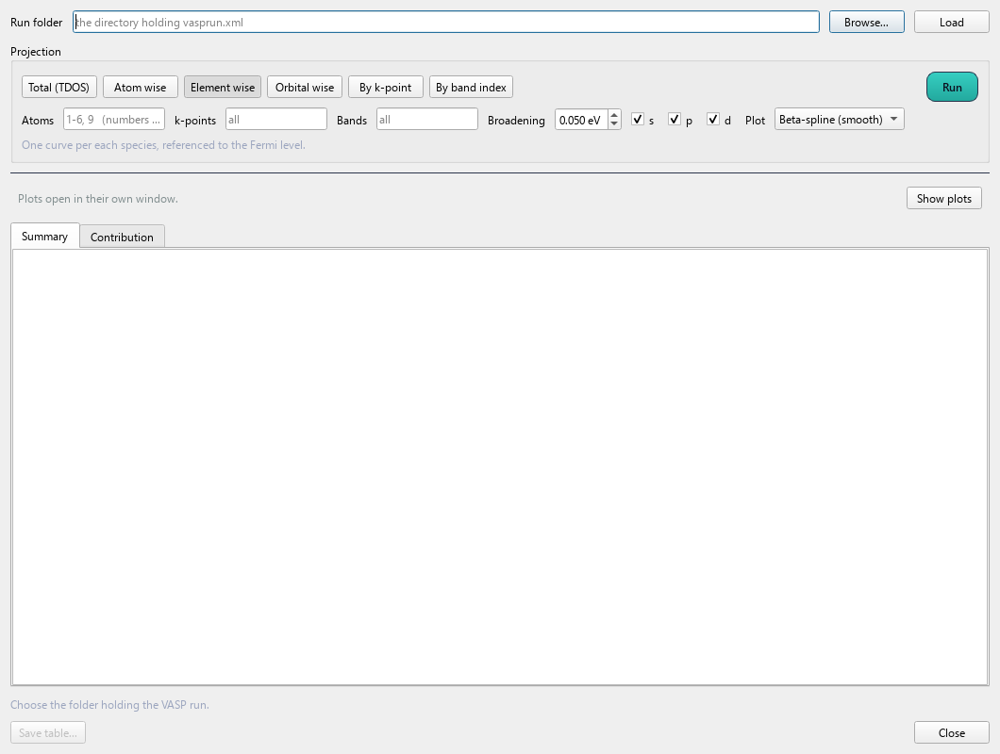
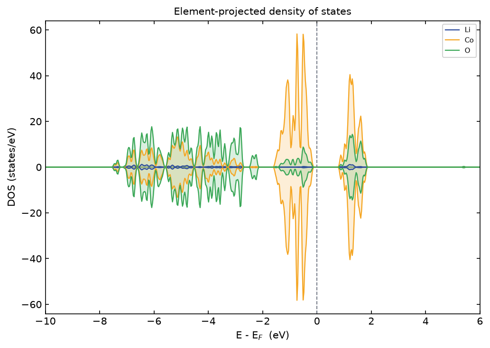
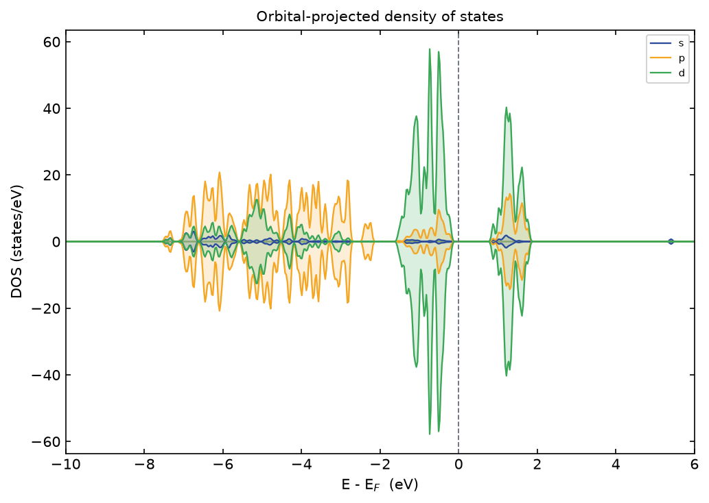
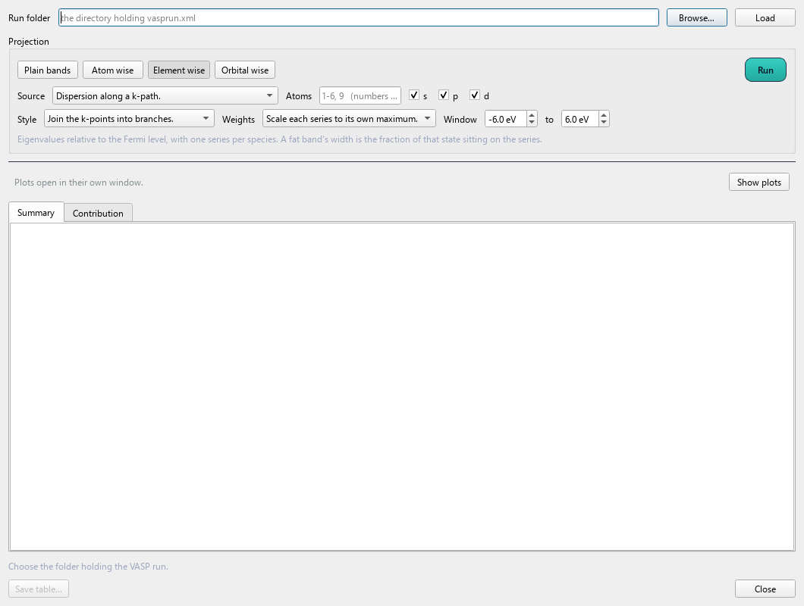
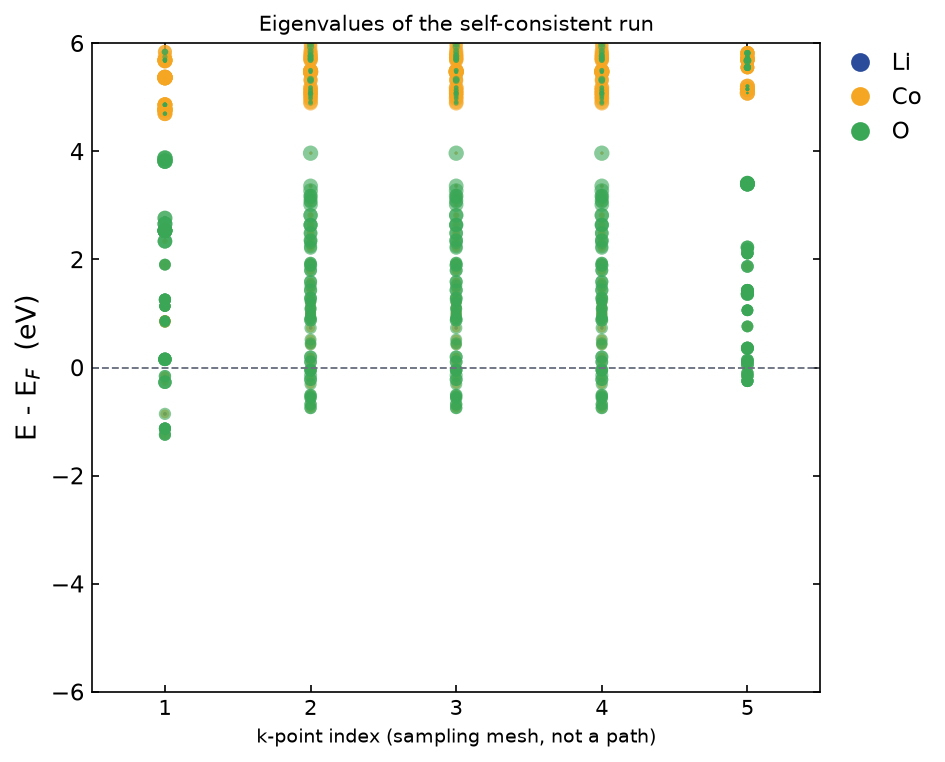
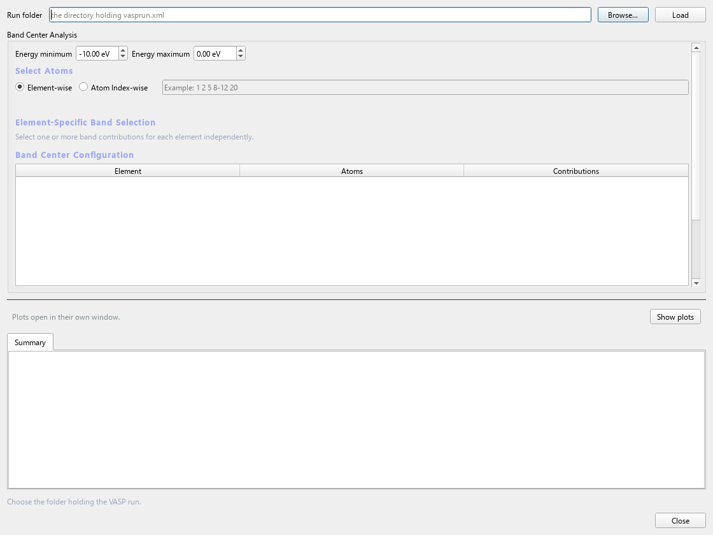
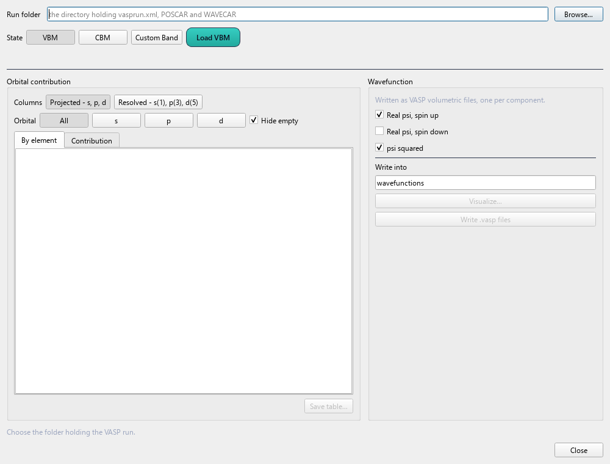
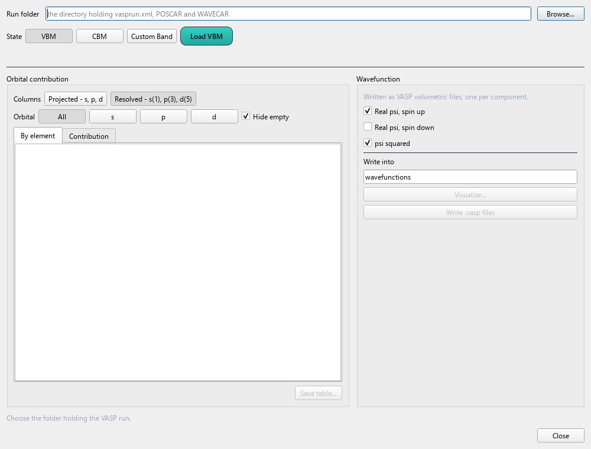

# 7. Electronic structure

`Analysis > Electrochemical Tools`

All of these read a **finished** VASP calculation. Point each dialog at
the folder containing `vasprun.xml`, `DOSCAR`, `EIGENVAL` and `PROCAR`.

---

## Density of States

`Analysis > Electrochemical Tools > DOS`



### The chemistry

The density of states counts how many electronic states exist per unit
energy:

```
D(E) = Σ_n ∫_BZ δ(E - ε_nk) dk
```

It is the band structure with the k-dependence integrated away. You lose
*where* in the zone a state is; you keep *how many* there are at each
energy, which is what determines occupancy, the gap, and the response to
doping.

**Projected** DOS decomposes it by which atom and orbital the state
sits on:

```
D_μ(E) = Σ_nk |⟨φ_μ | ψ_nk⟩|² δ(E - ε_nk)
```

where `φ_μ` is an atomic-like orbital. This needs `LORBIT = 11` in the
run.

The projection is onto spheres around each atom, so it is not a rigorous
partition — the weights do not sum to exactly one, and the sphere radii
are a convention. Use it to read *character*, not to extract precise
percentages.

### A real example



This is a real Li–Co–O calculation, referenced to E_F, spin-polarised so
the two channels are mirrored about zero.

Reading it:

- **O 2p** dominates the valence band, from about −7 to −1 eV
- **Co 3d** sits near the Fermi level — this is the redox-active state
- **Li** contributes almost nothing anywhere, which is the signature of
  a fully ionised Li⁺: it has donated its 2s electron to the framework

That last point is the chemical content of the figure. Li is not
covalently bonded to anything; it is a cation sitting in a hole. This is
exactly why drawing Li–O bonds in the viewport is misleading, and it is
why Li can move — an ion that is not bonded to the framework has a much
lower migration barrier.



The s/p/d decomposition of the same run makes the same point
differently: the states at E_F are d character, so oxidation on charging
removes d electrons.

### Line or spline

The dialog offers **line** or **B-spline** rendering. The spline is for
presentation, where a coarse energy grid looks jagged. It smooths; it
does not add information. Do not spline a DOS and then read fine
structure off it.

### What to check

- **The integral up to E_F** should give the electron count. A good
  sanity check that you are reading the file you meant to.
- **Spin asymmetry** is the magnetic moment. A symmetric DOS means a
  non-magnetic solution — which for a transition-metal oxide often means
  the calculation collapsed to the wrong state.
- **States exactly at E_F** in something you expect to be an insulator
  means the gap has closed, usually because `+U` was needed and omitted.

---

## Band structure

`Analysis > Electrochemical Tools > Band Structure`



### The chemistry

The band structure plots `ε_n(k)` along the high-symmetry path. It
carries what the DOS throws away — **where** in the zone each state is,
which determines:

**Direct or indirect gap.** If the valence band maximum and conduction
band minimum are at the same **k**, an electron can be promoted by a
photon alone (photons carry negligible momentum). If not, a phonon must
supply the momentum difference, making absorption much weaker. This is
the whole difference between GaAs and silicon as optical materials.

**Effective mass**, from the band curvature:

```
1/m* = (1/ℏ²) ∂²ε/∂k²
```

A flat band means a heavy carrier and poor mobility. Flat bands come
from localised orbitals with little overlap — d states of a transition
metal in an oxide, for example, which is why many oxide semiconductors
conduct badly.

**Degeneracies**, which are enforced by symmetry at high-symmetry
points and split as you move away.



### Fat bands

The projections can be drawn as **fat bands**: line width scales with
the weight of a chosen element or orbital along the path.

```
for each band n:
    for each k along the path:
        w = projection weight of (element, orbital) on state (n, k)
        line half-width at k  ∝  w
    draw the band as a varying-width line
```

Width rather than markers, because a scatter breaks the band into dots
and the eye stops following the branch.

This answers a question a plain band plot cannot: **what is the
conduction band minimum made of?** In a cathode that decides the
charge-compensation mechanism — if the CBM is metal-d, delithiation
oxidises the metal; if it is oxygen-p, you get oxygen redox and
potentially oxygen loss.

Fat bands need `LORBIT = 11`.

---

## Band Centre

`Analysis > Electrochemical Tools > Band Centre`



### The theory

The Hammer–Nørskov **d-band centre** is the first moment of the
projected DOS:

```
ε_d = ∫ E · D_d(E) dE  /  ∫ D_d(E) dE
```

referenced to E_F, over a chosen energy window.

In the d-band model, an adsorbate's level interacts with the metal d
band and splits into bonding and antibonding combinations. Where the d
band sits relative to E_F decides how much of the antibonding
combination ends up **below** E_F and therefore occupied:

- **d band close to E_F** → antibonding states pushed above E_F, mostly
  empty → **strong binding**
- **d band far below E_F** → antibonding states largely occupied →
  **weak binding**

This single number correlates with adsorption energies across a
transition-metal series, which is why it underpins so much
computational catalysis and appears in volcano plots.

```
select (atoms or elements) × (orbital: s, p, d, or resolved)

for each selection:
    D(E)   = projected DOS for that selection
    window = user choice, e.g. (-10, +5) eV about E_F
    centre = Σ E·D(E) ΔE / Σ D(E) ΔE   over the window
```

### Reading the plot

The plot has only an energy axis. Each selection is drawn as a
translucent cloud — the projected DOS itself — with a line marking its
centre. Overlapping clouds can be compared directly. There is nothing
meaningful on the x axis; it exists to give the clouds width.

**The window is part of the answer.** Include the empty states above
E_F and you get a different number than if you integrate only the
occupied part. Both are used in the literature. Quote which.

It is a **descriptor**, not an observable — useful for comparing
similar systems, not a physical quantity you can measure.

---

## Orbital projections

`Analysis > Electrochemical Tools > Orbital > Orbital Projected - spd`
`Analysis > Electrochemical Tools > Orbital > Orbital Resolved - d(5), p(3)`





### Why resolved matters: crystal field theory

In a free atom the five d orbitals are degenerate. Put the atom in an
octahedral field of six anions and they split:

```
        ____ ____        e_g   (d_z², d_x²-y²)   point AT the ligands
   ↑    
  Δ_o                                              
   ↓    ____ ____ ____   t_2g  (d_xy, d_yz, d_xz) point BETWEEN them
```

`e_g` orbitals point directly at the negative ligands and are pushed
**up**; `t₂g` point between them and are pushed **down**. In a
tetrahedral field the ordering inverts and the splitting is smaller
(Δ_t ≈ 4/9 Δ_o).

The consequences are everything an oxide chemist cares about:

- **High spin or low spin** — whether Δ exceeds the pairing energy
- **Jahn–Teller distortion** — an unevenly occupied `e_g` set (Mn³⁺,
  d⁴) distorts the octahedron to break the degeneracy, elongating two
  bonds. This is why LiMn₂O₄ suffers structural fatigue on cycling.
- **Which orbital is oxidised first** on charging

The **resolved** view shows this splitting directly — you can see the
t₂g and e_g manifolds as separate features and read Δ off the plot. The
**projected** (lumped s/p/d) view averages exactly that away.

Both need `LORBIT = 11`.

---

**Next:** [Bonding and charge](08-bonding.md) — where the electrons
actually sit.
