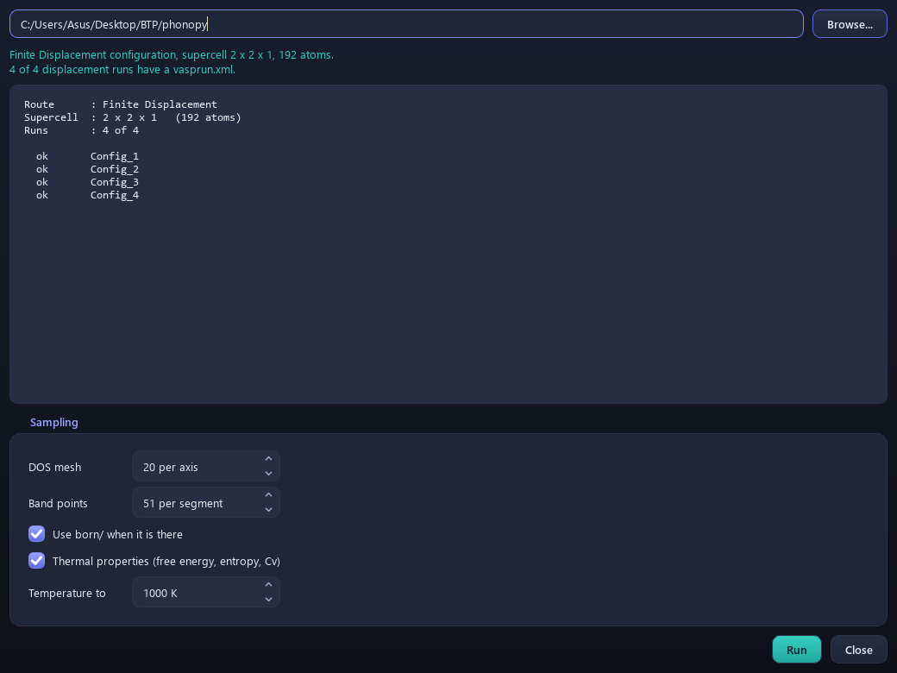

# 9. Phonons

> **This page has moved.** The tutorial now lives inside the QVista
> repository, and this copy is archived and no longer updated. The
> current version of this page is
> [here](https://github.com/CMCLAB-IITG/QVista/blob/main/docs/tutorial/09-phonons.md).

`Analysis > Phonon Analysis`

Lattice vibrations: whether your structure is a real minimum, and what
its thermal properties are.

Two routes, identical outputs. **CHGNet** computes the forces here in
minutes. **VASP** splits into pre-processing (write displaced supercells)
and post-processing (read the forces back).

---

## The theory

Expand the energy about the equilibrium geometry. The linear term
vanishes at a minimum, so the leading term is quadratic:

```
E = E₀ + ½ Σ_ij  Φ_ij  u_i u_j        Φ_ij = ∂²E / ∂u_i ∂u_j
```

`Φ` is the **force constant matrix**. Newton's equations for a periodic
crystal then give, for each wavevector **q**, the dynamical matrix:

```
D_ab(q) = (1/√(M_a M_b)) Σ_R  Φ_ab(R) · e^{iq·R}
```

and its eigenvalues are squared frequencies:

```
D(q) · e = ω²(q) · e
```

**This is why negative frequencies matter.** `ω² < 0` means `ω` is
imaginary, so the "vibration" `e^{iωt}` becomes a real exponential —
the displacement grows rather than oscillating. The structure is not a
minimum; it is a saddle point, and it will fall down that mode.

Imaginary frequencies are conventionally plotted as negative.

### Getting Φ: finite displacements

```
for each symmetry-inequivalent atom a:
    for each inequivalent direction:
        displace a by +u   (u ≈ 0.01 Å) in a supercell
        compute forces on every atom
        Φ_ab = -F_b / u
```

Symmetry does the heavy lifting — only inequivalent orbits and
directions need displacing, which is why the
[space group](06-symmetry.md) matters so much here.

---

## The CHGNet route

`Analysis > Phonon Analysis > CHGNet > ...`

QVista builds the supercell, displaces the atoms, evaluates forces with
the force field, and assembles `Φ`. No cluster involved.

### Phonon Band

Dispersion along the high-symmetry path.

**What to check, in order:**

**1. Are the acoustic branches zero at Γ?** They must be. Translating
the whole crystal costs no energy, so three modes go to zero at q = 0.
If they do not, the acoustic sum rule was not enforced and every
frequency is suspect.

**2. Is anything imaginary?** A few small imaginary modes near Γ are
usually numerical — an under-converged force calculation or a
too-small supercell. Large imaginary branches through the zone mean the
structure is genuinely unstable.

**3. Do the branch counts make sense?** An `N`-atom cell gives `3N`
branches: 3 acoustic, `3N − 3` optical.

### Band with DOS

Dispersion beside the phonon density of states, sharing a frequency
axis. Flat branches in the dispersion become sharp peaks in the DOS,
because a flat band means many modes at the same frequency.

### Projected Phonon Band

Colours branches by which atoms move. Mass matters: `ω ∝ 1/√M`, so
light atoms dominate the high-frequency modes and heavy ones the low.

In a cathode this cleanly separates the low-frequency alkali-metal modes
from the high-frequency oxygen ones — useful because the **soft modes
are the ones relevant to ion transport**.

### Band Visualization

Animates a selected mode: click a point on the dispersion and watch the
atoms move along that eigenvector in the main viewport.

This is the fastest way to understand an imaginary mode. The animation
shows you *what distortion the structure wants to make* — an octahedral
rotation, a sublattice displacement, a shear. That usually identifies
the true ground state directly: follow the mode, re-relax, and you land
in the lower-symmetry structure.

### Custom paths

Both band plots let you choose the path **on the plot itself** — plot
the bands, then pick high-symmetry points and add breaks, and the figure
redraws.

This is deliberately different from the k-path tool in
[Symmetry](06-symmetry.md): that one writes a KPOINTS file for a VASP
run; this one re-plots a phonon calculation you already have. No
recomputation.

### Thermal Properties

Every thermodynamic quantity follows from the phonon DOS `g(ω)` in the
harmonic approximation:

```
F_vib(T) = ∫ g(ω) [ ½ℏω + k_B T ln(1 - e^{-ℏω/k_B T}) ] dω

S(T)     = k_B ∫ g(ω) [ (ℏω/k_BT)/(e^{ℏω/k_BT} - 1) - ln(1 - e^{-ℏω/k_BT}) ] dω

C_V(T)   = k_B ∫ g(ω) (ℏω/k_BT)² e^{ℏω/k_BT} / (e^{ℏω/k_BT} - 1)² dω
```

The `½ℏω` term is the **zero-point energy** — vibrational energy that
does not vanish at 0 K. It is not negligible: for a hydride it can shift
a formation energy by hundreds of meV and change which phase is
predicted stable.

**The free-energy panel is F_vib, the vibrational part only.** The DFT
ground-state energy is not included. To compare two phases you need:

```
G(T) ≈ E_DFT + F_vib(T)
```

for each. Comparing F_vib alone will mislead you, because E_DFT is
usually the larger term.

**Check:** C_V must approach `3Nk_B` at high temperature (Dulong–Petit).
If it does not, the DOS did not integrate correctly.

---

## The VASP route

`Analysis > Phonon Analysis > VASP > ...`

### Pre-Processing


You choose the supercell and QVista writes the displaced structures plus
a matching INCAR.

**Supercell size is the accuracy knob.** Force constants have a finite
range — an atom's displacement affects neighbours out to some distance.
If the supercell is smaller than that range, the periodic images
interact with themselves and `Φ` is wrong away from Γ.

```
a supercell of at least ~10 Å in every direction
```

A cell too small is the most common cause of **spurious imaginary
modes**, and it is worth ruling out before concluding a structure is
unstable: enlarge the supercell and see whether the imaginary branch
survives.

Run each displaced supercell in VASP with the tight settings from
[INCAR](03-incar.md) — `EDIFF = 1E-8`, no ionic steps.

### Post-Processing



**Read Configuration** points QVista at the finished runs and assembles
the force constants. After that, all five outputs behave identically to
the CHGNet route.

---

## Which route to use

**CHGNet** to check dynamical stability before committing cluster time,
and to screen candidates. An imaginary mode it finds is worth
investigating.

**VASP** for anything you will publish. Force-field frequencies are not
publication numbers — the potential was trained on energies and forces
at relaxed and near-relaxed geometries, and second derivatives are a
harder test than anything in its training objective.

---

**Next:** [NEB](10-neb.md) — where the soft modes point.
