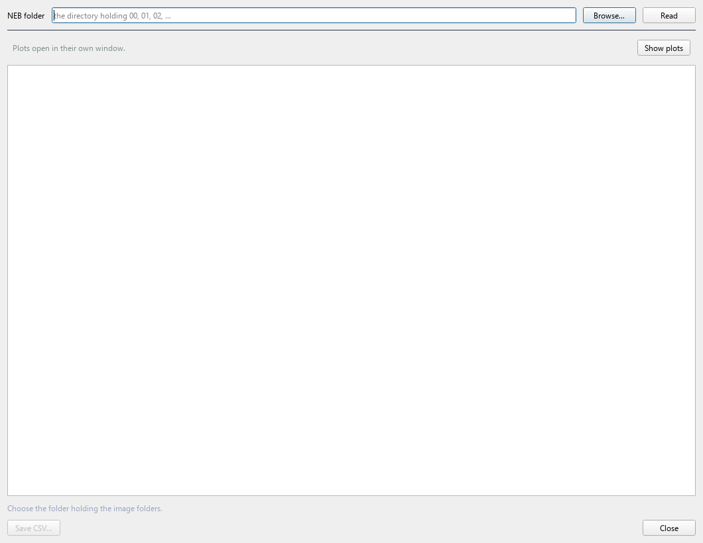

# 10. NEB — migration barriers

`Analysis > NEB`

The energy along the path an ion takes between two sites, and the
barrier at the top of it.

---

## The theory

A migrating ion moves on the potential energy surface from one minimum
to another. The path that matters is the **minimum energy path**: the
one where, at every point, the force perpendicular to the path is zero.
The highest point on it is the saddle, and the barrier is

```
E_a = E(saddle) - E(initial)
```

which sets the hop rate through transition state theory:

```
k = ν · exp(-E_a / k_B T)
```

with `ν` an attempt frequency of order 10¹²–10¹³ s⁻¹ (a phonon
frequency — which is why [phonons](09-phonons.md) and NEB belong
together).

### How the band works

Take `N` images along an interpolated path. Each feels the true force
plus a spring to its neighbours, and each force is projected:

```
for each intermediate image i:
    τ_i = unit tangent along the path at i

    F_i^⊥      = F_true(i) - (F_true(i)·τ_i) τ_i     # true force, perpendicular only
    F_i^spring = k[|R_{i+1} - R_i| - |R_i - R_{i-1}|] τ_i   # spring, parallel only

    F_i = F_i^⊥ + F_i^spring
```

The projection is the whole trick. Keeping only the perpendicular true
force lets images relax onto the path without sliding along it; keeping
only the parallel spring force keeps them evenly spaced without pulling
them off the path — the "nudging".

### Climbing image

Even with a converged band, no image sits exactly on the saddle, so the
barrier is whatever the highest sampled image happened to be —
systematically **too low**.

CI-NEB fixes this. The highest image gets no spring force, and its true
parallel force is *inverted*:

```
F_max = F_true - 2(F_true·τ)τ
```

so it climbs uphill along the path while relaxing downhill perpendicular
to it. It converges onto the saddle exactly.

**Leave CI-NEB on.** Without it your barrier is an underestimate of
unknown size.

---

## Before you start

Two **relaxed** endpoints — the ion in its start site and in its end
site — with:

- the **same atoms in the same order**
- the **same cell**

NEB interpolates atom by atom. Different ordering means interpolating
atom 5 into atom 12's position, and the path is nonsense.

**Relax the endpoints with `ISIF = 2`.** A free cell relaxes the two
endpoints to slightly different lattice parameters, and a band has one
cell. QVista handles small discrepancies by putting both on the initial
cell using fractional coordinates, and warns above 0.01 Å — but it is
better not to create the problem.

---

## The CHGNet route

`Analysis > NEB > CHGNet`


Everything in one window: choose endpoints, set the path, run, read the
results below.

| Setting | |
|---|---|
| **CI-NEB** | leave on |
| **Fmax** | force convergence, eV/Å |
| **Images** | intermediate images, endpoints excluded |
| **Max steps** | optimiser cap |

More images resolve the path better but cost proportionally more — each
optimiser step evaluates forces on every intermediate image. Five is a
sensible default.

### Save the run

A relaxation takes minutes, so **Save outputs to** writes the relaxed
images as CONTCARs, the profile as `neb.dat` and `neb.csv`, the
trajectory, the log, and the plot. The folder is written in the layout
the reader expects, so a saved run **reopens through
`NEB > VASP > Post-Processing`** instead of being run again.

### Watching it

Progress goes to the status line and the console with a rate, so you can
tell "slow" from "hung":

```
[9/100] max|F| = 0.1869 eV/Å (target 0.12) -- 13 s, 1.5 s/step
```

---

## The VASP route

### Pre-Processing

`Analysis > NEB > VASP > Pre-Processing`


Interpolates and writes the numbered folders VASP expects:

```
nebexp/
  INCAR  KPOINTS  POTCAR
  00/POSCAR     start, fixed
  01/POSCAR ... 05/POSCAR
  06/POSCAR     end, fixed
```

**`IMAGES` counts intermediate images only.** Five images between two
endpoints is `IMAGES = 5` and **seven** folders. Off-by-one here is the
classic NEB setup error: VASP either refuses to start or silently treats
an endpoint as movable.

**Interpolation uses the minimum image convention:**

```
Δ = frac(final) - frac(initial)
Δ = Δ - round(Δ)                    # take the short way round the cell

image_k = frac(initial) + (k / (N+1)) · Δ
```

Without that, an ion crossing the cell boundary between endpoints —
exactly what a migrating ion does — is interpolated the *long* way
round, straight through the rest of the structure. The path looks
plausible in a viewer and the barrier is meaningless.

QVista reports which atoms move more than a threshold, so you can
confirm the path is the one you meant. If forty atoms move, you have a
phase transition, not an ion hop.

### Post-Processing

`Analysis > NEB > VASP > Post-Processing`



Point it at the folder containing `00`, `01`, … and it reads the
energies and tangent forces from each image.

---

## Reading the results

Both routes end in the same view.

### The profile

Energy against **reaction coordinate** — cumulative distance along the
path in Å, not image index, so the spacing is physical:

```
s_k = Σ_{j<k} | R_{j+1} - R_j |        the 3N-dimensional distance
```

The curve is a **force-informed spline**. Each image gives an energy
*and* the force projected along the path, which is the gradient — so
each point contributes both a value and a slope, and a handful of images
define a smooth curve rather than points to be joined by straight lines.

```
for each image:  (s_k, E_k, dE/ds|_k = -F_k·τ_k)
fit a cubic Hermite spline through value and slope at each knot
barrier = max(spline)
```

**The spline peak is usually higher than the highest image**, because
the true saddle generally falls between two images. This is what VTST's
`nebspline.pl` does.

### The summary table

Method, image counts, whether CI was on, **the barrier**, and which
image the saddle sits at.

One barrier, not three. Forward, reverse and spline-peak side by side
invites quoting whichever suits the argument; on an asymmetric path the
forward barrier is the barrier.

### The coordination table

What the migrating ion is bonded to at the **initial**, **transition**
and **final** states — coordination number, neighbour species, bond
lengths.

**This is where the barrier gets explained.** A Li that goes from
6-coordinate in its site to 4-coordinate at the saddle is squeezing
through a bottleneck, and that coordination loss *is* the barrier: you
are paying to break two Li–O interactions.

This is why layered oxides conduct: the path between octahedral sites
passes through a tetrahedral interstice, and the barrier is set by how
much the tetrahedron has to expand. It is also why divalent ions
(Mg²⁺, Ca²⁺) are so much slower — twice the charge means twice the
electrostatic cost of the same coordination loss.

**The cutoff is adjustable and the table says what it was.** A search
radius is not a bond cutoff: at 3.2 Å a migrating Li in an oxide comes
back 16-coordinate — six oxygens it is bonded to plus the next shell of
metals that are merely nearby. The 2.6 Å default keeps the first shell.

### Structures

A dropdown loads each stage into the main viewer with the migrating atom
highlighted:

- **Initial**, **Transition state**, **Final**
- **MEP** — the framework once, with the migrating atom drawn at *every*
  image

The MEP entry is a picture of the path rather than of a point on it. The
trail of copies shows whether the ion goes straight through the
bottleneck or bows around it — which a single barrier number cannot tell
you, and which decides whether a dopant on the bottleneck would help.

---

## Sanity check against experiment

A barrier of ~0.3 eV is a good conductor; ~0.6 eV is sluggish at room
temperature; above ~1 eV nothing moves. Compare against the activation
energy from [molecular dynamics](11-molecular-dynamics.md): if the MD
`E_a` is much lower than your NEB barrier, diffusion is going by a path
you did not test.

---

**Next:** [Molecular dynamics](11-molecular-dynamics.md).
