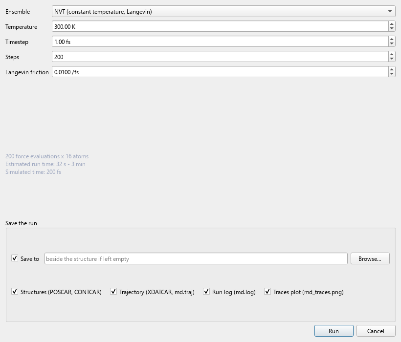
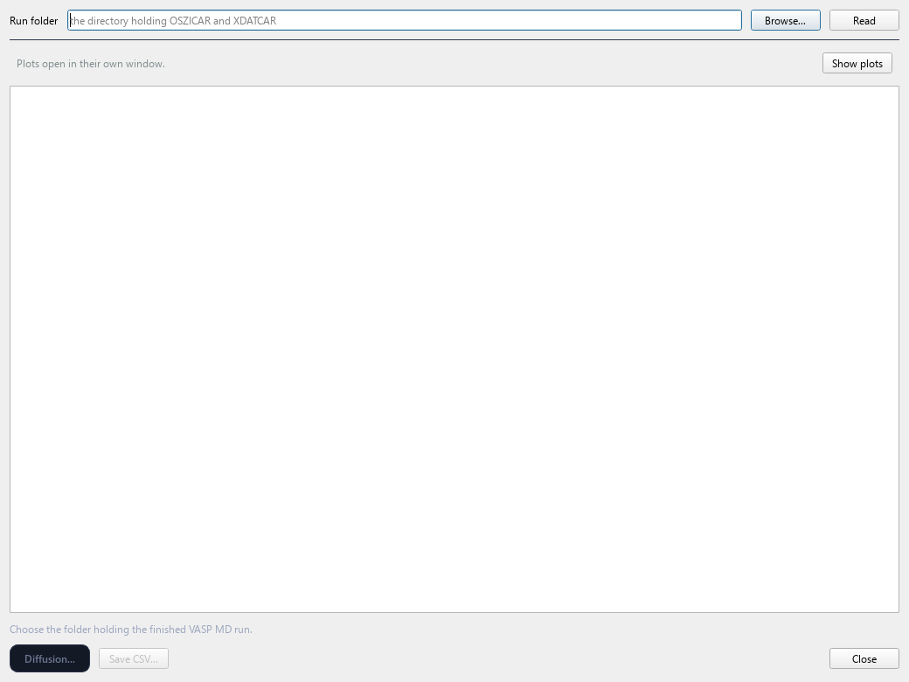
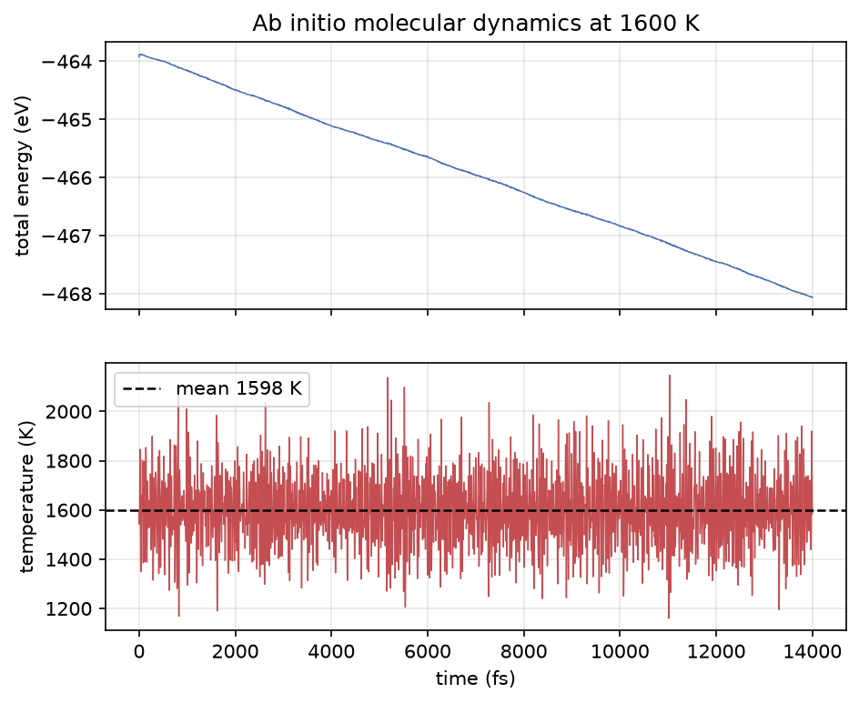
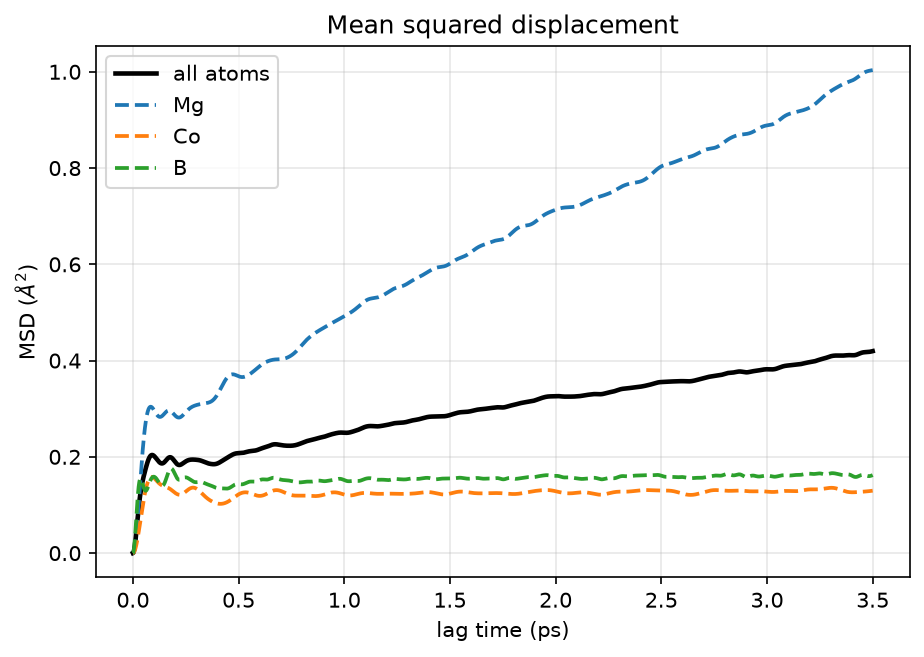
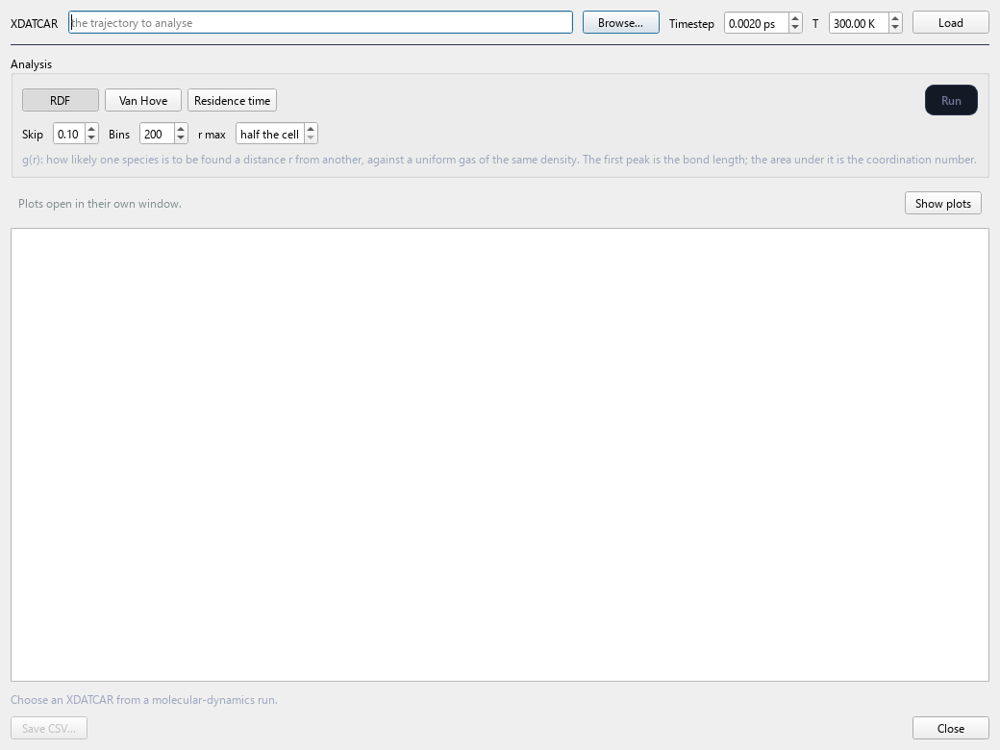
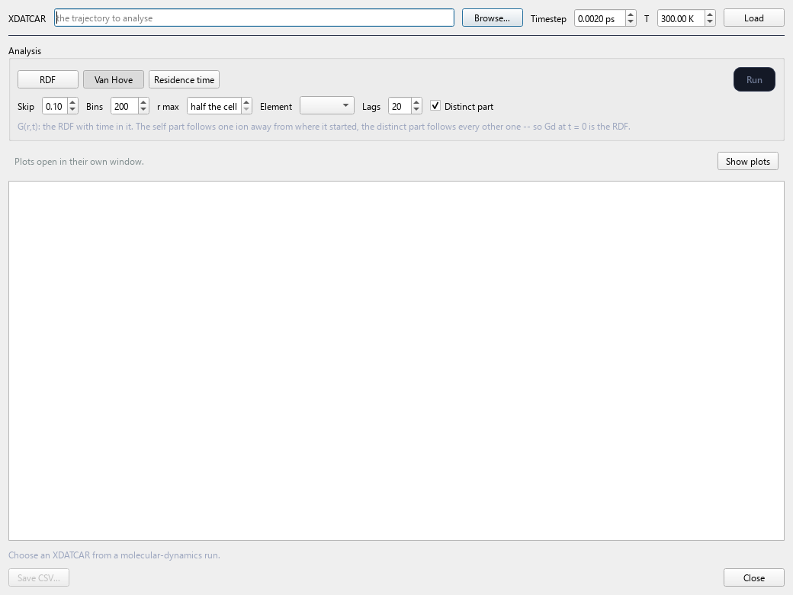
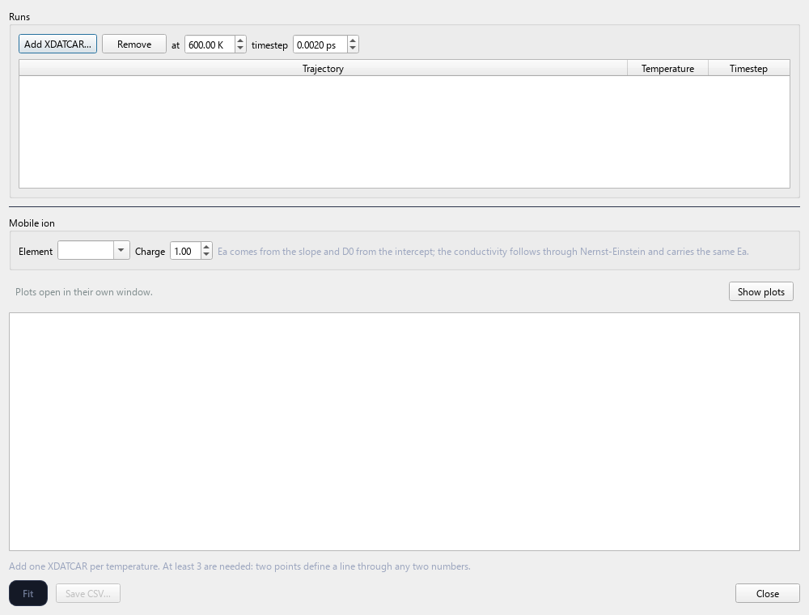

# 11. Molecular dynamics

`Analysis > MD`

Running dynamics, and the transport properties extracted from a
trajectory.

Where [NEB](10-neb.md) assumes a path and measures its barrier, MD
assumes nothing and lets the ions find their own way. It samples every
mechanism that operates at that temperature, including ones you would
not have thought to test.

---

## The theory

Integrate Newton's equations with forces from DFT (or a force field) at
every step:

```
F_i = -∂E/∂R_i           from the electronic structure, each step

# Velocity Verlet
R(t + Δt) = R(t) + v(t)Δt + ½ a(t) Δt²
v(t + Δt) = v(t) + ½ [a(t) + a(t + Δt)] Δt
```

The result is a trajectory — positions against time — from which every
transport property follows.

### The ensembles

**NVE** conserves total energy. Nothing controls the temperature; it is
whatever the initial velocities give. Its value is diagnostic: total
energy *must* be conserved, so drift is a direct measure of integration
error.

**NVT** couples to a thermostat. A **Langevin** thermostat adds friction
and a random force satisfying the fluctuation–dissipation theorem:

```
m dv/dt = F - γ m v + √(2 γ m k_B T) · ξ(t)
```

A **Nosé–Hoover** thermostat instead extends the system with a fictitious
degree of freedom and is deterministic. Use NVT for equilibrium
properties.

---

## Running with CHGNet

`Analysis > MD > CHGNet > Run Dynamics`



| | |
|---|---|
| **Ensemble** | NVE or NVT (Langevin) |
| **Temperature** | K |
| **Timestep** | fs |
| **Steps** | how many |
| **Friction** | Langevin coupling |

### Choosing the timestep

The timestep must resolve the fastest vibration. A metal–oxygen stretch
around 20 THz has a ~50 fs period, so 1–2 fs gives 25–50 points per
period. Hydrogen at ~100 THz needs 0.5 fs.

Too long shows up as **energy drift in NVE**, which QVista reports per
atom. Above ~1 meV/atom, halve it.

### Save the run

The trajectory otherwise exists only in the session. **Save the run**
writes:

```
POSCAR CONTCAR   first and last frame
XDATCAR          every recorded frame
INCAR            the settings, so the frames have a time axis
md.traj          the same frames for ASE
md.csv           energy and temperature against time
md.log           step by step
```

The folder **reopens through `MD > VASP > Analysis`**. There is no
OSZICAR in it because VASP did not run — the energies are in `md.csv`,
and QVista does not fabricate VASP output.

---

## Reading a VASP AIMD run

`Analysis > MD > VASP > Energy Plot`



Point it at a finished AIMD folder. It reads `OSZICAR` for the traces
and `XDATCAR` for the positions.

`OSZICAR` rather than `vasprun.xml` deliberately: an AIMD run killed by
a wall clock — which is most of them — leaves a truncated
`vasprun.xml` that will not parse at all, while its `OSZICAR` is
complete up to the last step written.

### A real run



This is a genuine 14 ps, 94-atom VASP AIMD run at 1600 K.

Two things to read from it:

**The temperature (bottom) fluctuates hugely** — 1200 to 2100 K — while
averaging 1598 K, essentially exactly the target. That is correct and
expected. Instantaneous temperature is a function of the kinetic energy
of a finite number of particles, and its relative fluctuation goes as

```
σ_T / T  ≈  √(2 / 3N)
```

For 94 atoms that is about 8%, which is what the plot shows. **A
temperature trace that does *not* fluctuate means an over-damped
thermostat that is not sampling the ensemble properly.**

**The total energy (top) drifts downwards** by ~4 eV over 14 ps. In NVT
some exchange with the thermostat is expected, but a systematic
downward drift like this usually means the system is still relaxing —
finding a lower-energy configuration — which means the first part of
the run is not equilibrated and should be discarded before any averaging.

This is exactly the kind of thing the traces are for.

---

## MSD and Diffusion

`Analysis > MD > ... > Analysis > MSD and Diffusion`


### The theory

Mean squared displacement, averaged over atoms and time origins:

```
MSD(t) = ⟨ |r_i(t₀ + t) - r_i(t₀)|² ⟩_{i, t₀}
```

In the diffusive regime the Einstein relation gives

```
MSD(t) = 6 D t          (three dimensions)
MSD(t) = 4 D t          (two — a layered conductor)
MSD(t) = 2 D t          (one — a channel conductor)
```

**Use the right dimensionality.** Using 6 for a layered material where
ions only move in-plane underestimates D by a third.



### Reading it honestly

The curve has three regimes:

```
short t     ballistic,  MSD ∝ t²      atoms fly before any collision
middle      caged,      plateau       rattling in a site, not yet hopping
long t      diffusive,  MSD ∝ t       ← fit only this
```

**Fit only the linear part.** Fitting the whole curve gives a number
that is not a diffusion coefficient. QVista lets you set the window and
shows what was fitted.

**The tail is noisy.** At a lag close to the run length there are few
independent time origins to average over, so the last third is
statistically worthless even though it is plotted. Fit the middle.

**A plateau is not a small D.** If the curve flattens, the ion never
hopped during your run. The honest conclusion is an *upper bound*, not a
small number.

Positions are unwrapped across periodic boundaries and centre-of-mass
drift removed first — without unwrapping, an ion crossing the cell edge
registers as a jump of a whole lattice vector.

### How long is long enough

Diffusion in a solid normally needs **tens of picoseconds** and several
independent runs. A few hundred femtoseconds tells you the setup is
stable and nothing else. Ideally you want each mobile ion to hop many
times.

---

## RDF

`Analysis > MD > ... > Analysis > RDF`



```
g_AB(r) = (1 / ρ_B N_A) ⟨ Σ_i∈A Σ_j∈B δ(r - r_ij) ⟩ / 4πr²
```

The probability of finding a B atom at distance r from an A atom,
relative to a uniform distribution. It is 1 at large r by construction.

- **First peak position** = bond length
- **Area under the first peak** = coordination number
- **How deep the first minimum goes** = how well-defined the shell is

Comparing g(r) at two temperatures shows whether coordination changes. A
first peak that broadens while the minimum behind it fills in means the
shell is dissolving — the structure is melting, or the mobile sublattice
is becoming liquid-like while the framework stays solid. That second
case is exactly what **superionic conduction** looks like.

---

## Van Hove Correlation

`Analysis > MD > ... > Analysis > Van Hove Correlation`



The time-resolved generalisation of the RDF, split into two parts:

```
G_s(r,t) = ⟨ (1/N) Σ_i  δ(r - |r_i(t) - r_i(0)|) ⟩      self
G_d(r,t) = ⟨ (1/N) Σ_i≠j δ(r - |r_i(t) - r_j(0)|) ⟩     distinct
```

The split is the point:

**Self part** — where an atom is at time `t` given where **it** was at
`t = 0`. A single peak spreading out is vibration. A **second peak
appearing at the jump distance** is hopping, and the time at which it
appears is the residence time.

**Distinct part** — where the *other* atoms are. The first peak filling
in over time means neighbours are exchanging places, i.e. concerted
motion rather than isolated hops.

Together these distinguish an ion that rattles from one that hops, and
reveal whether hops are independent or correlated — which matters for
[conductivity](13-conductivity.md), because Nernst–Einstein assumes they
are independent.

---

## Residence Time

`Analysis > MD > ... > Analysis > Residence Time`


How long an ion stays in a site before moving on.

The connection: hop rate ≈ 1/residence time, and a hop rate with a hop
distance gives a diffusion coefficient:

```
D ≈ (1/6) · a² / τ_residence          for 3D, uncorrelated hops
```

which can be compared against the MSD fit. If the two disagree, one is
being read wrong — usually the MSD, fitted outside its linear region.

Residence time also links MD back to [NEB](10-neb.md): the NEB barrier
predicts a hop rate through `k = ν exp(-E_a/k_BT)`, and this measures it.

---

## Diffusion Kinetics (D₀, Eₐ)

`Analysis > MD > ... > Diffusion Kinetics (D0, Ea)`



Combines diffusion coefficients from **several temperatures**:

```
D(T) = D₀ exp(-E_a / k_B T)

ln D = ln D₀ - (E_a/k_B)(1/T)        ← straight line against 1/T
```

Fit `ln D` against `1/T`: the slope gives `E_a`, the intercept `D₀`.

**Three or more temperatures.** Two points define a line with no way to
tell whether it is straight, and **curvature is real information** — it
usually means the mechanism changes with temperature, or that you have
crossed a phase transition.

**Compare `E_a` with the NEB barrier.** They should agree if the NEB
found the path that dominates. A much lower MD `E_a` means real
diffusion is going by a route the NEB did not test.

Extrapolating from high-temperature MD — where you can afford the
statistics — down to room temperature is the standard way to get a
usable D. It assumes the mechanism does not change over that range,
which is exactly what curvature in the plot would warn you about.

---

**Next:** [Mechanical properties](12-mechanical.md).
