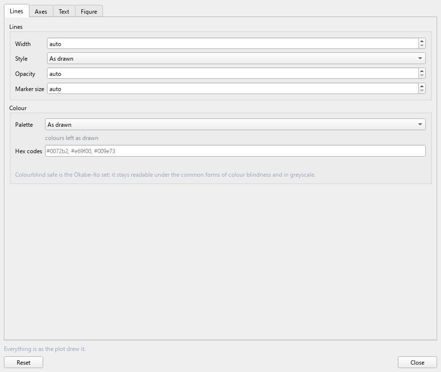

# 14. Plots and export

> **This page has moved.** The tutorial now lives inside the QVista
> repository, and this copy is archived and no longer updated. The
> current version of this page is
> [here](https://github.com/CMCLAB-IITG/QVista/blob/main/docs/tutorial/14-plots-and-export.md).

Every figure QVista draws goes through the same styling layer, so what
you learn here applies to all of them.

---

## Plot Design

Opens beside any figure and restyles it live. No recomputation — you
iterate on the appearance while the numbers stay fixed.

| | |
|---|---|
| **Colours** | palettes, including greyscale |
| **Lines** | width and style |
| **Fonts** | family and size for labels, ticks, legend |
| **Axes** | limits, ticks, grid |
| **Legend** | position, frame, visibility |
| **Figure** | size and aspect ratio |

### Legends follow the lines

Change the palette and the legend changes with it, in every plot type.

Worth stating because it is easy to get wrong: fat bands are drawn as
line *collections* while the legend uses proxy handles — two different
matplotlib objects each holding their own copy of the colour. Restyle
one and not the other and you get a greyscale figure with a colour key
describing lines that are no longer coloured. That survives review more
often than it should.

### Use greyscale deliberately

If a figure is readable in greyscale it is readable to a colourblind
reader and it survives a black-and-white printer. If it is not, the
figure depends on colour to be understood — which is worth discovering
before submission rather than after.

For band structures and DOS, distinguish series by **line style** as
well as colour wherever you can.

---

## Saving a figure

Every plot window has its own **Save**. Use it rather than a screenshot:
it saves the figure object, so you get proper resolution and vector
output.

| Format | For |
|---|---|
| **PDF**, **SVG**, **EPS** | vector — scales without pixelation; what journals ask for |
| **PNG** | raster; slides and web |
| **TIFF** | raster at a specified DPI, sometimes required |

Prefer vector for line plots. A band structure saved as PNG at 300 dpi
looks fine on screen and disappointing in print; the same figure as PDF
is sharp at any size.

Rasterise only genuinely dense content — a fat-band plot with thousands
of segments can produce a very large PDF, and rasterising just that
layer while keeping the axes and text as vectors is the usual
compromise.

---

## Exporting the structure

`File > Export Image`

For the 3D viewport rather than a plot. Choose format and resolution;
the image is rendered by supersampling, so a 4× export genuinely has 4×
the detail rather than being an upscaled screenshot. The orientation
marker scales with it, so the axis triad stays proportionate.

### Making a structure figure legible

**Parallel projection**, which is the default — distances stay
comparable across the cell. A perspective figure is not measurable.

**Turn off bonds you do not mean.** In a layered cathode, Li–O bonds
imply covalency that is not there and hide the layered structure. Bond
types can be switched off per element pair.

**Look down a symmetry direction.** A layered structure viewed down the
layers shows the stacking; from an arbitrary angle it shows a mess.

**Show periodic images** where coordination at the cell boundary would
otherwise look wrong.

**Export at 2–4× final size and downscale.** The antialiasing from
downscaling looks better than rendering at final size.

---

## Exporting data

`File > Export Data` writes the structure as POSCAR, CIF, XYZ and
others.

Each analysis window also has **Save CSV**, which writes the numbers
behind the figure — band energies, the DOS, the NEB profile, the MSD
curve. Use it to re-plot elsewhere, or when a reviewer asks for the
underlying data.

Saving the CSV alongside the figure is worth the habit. A figure you
cannot regenerate is a figure you cannot correct.

---

## Method attribution

Figures produced from a force field are stamped with the method —
CHGNet, and the fact that it is not DFT.

That is deliberate and not removable. A barrier, a phonon spectrum or an
elastic constant from a trained surrogate is not a first-principles
number, and a figure that circulates without saying so eventually gets
quoted as one. The stamp is there so the provenance travels with the
picture.

When you write the paper, say which quantities came from which route.

---

## Back to the [contents](README.md)
