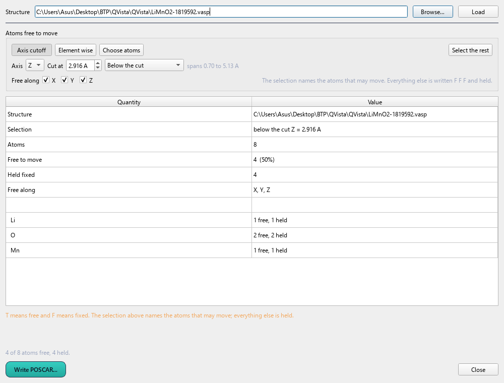
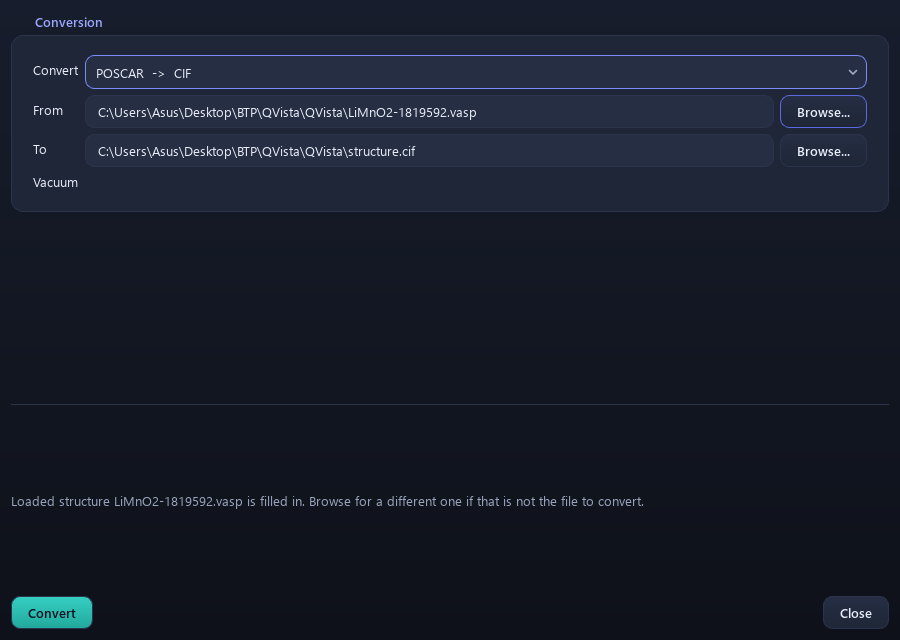

# 15. Editing structures

> **This page has moved.** The tutorial now lives inside the QVista
> repository, and this copy is archived and no longer updated. The
> current version of this page is
> [here](https://github.com/CMCLAB-IITG/QVista/blob/main/docs/tutorial/15-editing-structures.md).

`Edit Structure`

Changing the structure before you compute with it. Three tools, each
for a different kind of model.

---

## Remove Atom

`Edit Structure > Remove Atom`

Opens a panel and arms picking in the viewport. Click atoms to select
them, right-click to clear, and remove the selection. Every removal is
pushed onto an undo stack.

The panel is a **utility window**: it stays above the main window while
you keep clicking atoms behind it.

### The chemistry: point defects

The usual reason to be here is a **vacancy**. Remove one atom, relax,
and the energy difference gives the formation energy:

```
E_f[V_Li] = E(defect cell) - E(perfect cell) + μ_Li
```

where `μ_Li` is the chemical potential of the removed species — the
energy of the reservoir it goes to. For lithium that is usually Li
metal, or the anode potential; the choice sets the reference and must
be stated.

Vacancy formation energies decide a great deal:

- **Whether a material can be delithiated at all**, and at what voltage
- **The carrier concentration** for ionic conduction — a perfect crystal
  with no vacancies cannot conduct by a vacancy mechanism, however low
  the [migration barrier](10-neb.md) is

Conductivity needs both: carriers **and** mobility. `σ ∝ n · exp(-E_a/k_BT)`,
and `n` comes from the defect chemistry while `E_a` comes from the NEB.

### Two things to get right

**Relax with `ISIF = 2`.** The comparison is meaningless if the defect
cell and the perfect cell end up at different volumes.

**Watch the supercell size.** A charged defect interacts with its own
periodic images through the Coulomb interaction, which decays only as
`1/L`. A 2×2×2 cell is usually too small; corrections (Makov–Payne,
Freysoldt) exist but the honest approach is to check convergence against
cell size.

---

## Selective Dynamics

`Edit Structure > Selective Dynamics`



Adds the `T`/`F` flags to a POSCAR that tell VASP which atoms may move.

```
Direct
  0.5000 0.5000 0.7500   T T T      free
  0.5000 0.5000 0.2500   F F F      frozen
  0.5000 0.5000 0.5000   T T F      free in-plane only
```

Click atoms in the viewport to select them, then set their flags. The
dialog is modeless because you have to keep clicking the structure while
it is open.

### Why slabs need this

A surface calculation models a semi-infinite solid with a finite slab.
The bottom of the slab is supposed to *be* bulk — it is standing in for
the material continuing downwards.

If everything relaxes, the whole slab reconstructs into something that
is no longer bulk-terminated at the bottom, and the surface energy you
extract afterwards

```
γ = (E_slab - N·E_bulk) / 2A
```

is contaminated: `E_slab` no longer contains a bulk-like region, so
subtracting `N·E_bulk` does not leave you with two surfaces.

**Freeze the bottom two or three layers, let the top relax.** Then check
convergence by adding layers: when the surface energy stops changing,
the slab is thick enough.

The same applies to adsorption studies — freeze the bottom, relax the
top and the adsorbate.

---

## Convert

`Edit Structure > Convert`



Reads one structure format and writes another — POSCAR, CIF, XYZ and
the rest.

Conversion is not symmetric in what it preserves:

| Format | Carries |
|---|---|
| **CIF** | symmetry operations, occupancies, thermal parameters, metadata |
| **POSCAR** | lattice, positions, selective-dynamics flags — no symmetry |
| **XYZ** | positions only; no cell at all unless extended XYZ |

So a CIF → POSCAR conversion **expands** the symmetry into an explicit
list of atoms and discards the operations; going back the other way
means re-detecting the symmetry, which is what the
[Space Group Analyzer](06-symmetry.md) is for.

**A CIF with partial occupancies cannot be converted faithfully.** A
site listed as 0.5 Li means the crystallographic average over a
disordered structure, and DFT needs a specific arrangement. You have to
choose an ordering — and the choice matters, so it is worth generating
several and comparing energies rather than taking the first one.

QVista converts the geometry faithfully and drops what the target format
has no place for.

---

## Back to the [contents](README.md)
