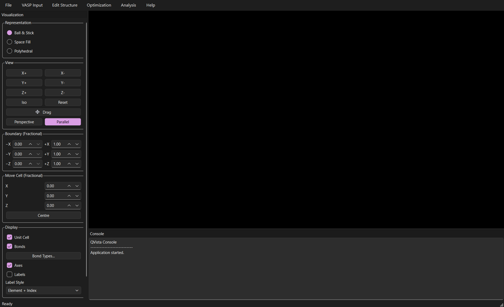

# QVista Tutorial



A complete walkthrough of [QVista](https://github.com/CMCLAB-IITG/QVista),
from opening a structure to every analysis it performs.

Each page covers one part of the program and gives you three things:
the **chemistry** the tool is computing, the **procedure** as pseudocode
so you can see what actually happens, and **screenshots** of the working
application at each step.

## Before you start

Install QVista into a virtual environment of its own:

```bash
git clone https://github.com/CMCLAB-IITG/QVista.git
cd QVista

python -m venv .venv
.venv\Scripts\activate                    # Linux: source .venv/bin/activate

pip install -e .
pip install -e ".[ml]"                    # optional, for the CHGNet menus

qvista
```

The last line is how you launch it, every time.

Python 3.11 or newer is required, and on Linux there are system
libraries to install first. The
[Installation section of the QVista README](https://github.com/CMCLAB-IITG/QVista#installation)
has the full steps for both platforms, and a troubleshooting list keyed
by the error you actually see.

## Follow the workflow

The pages are in the order you would actually use them. If you are new,
read them in sequence — each one assumes the previous step.

| | | |
|---|---|---|
| **1** | [Opening a structure](01-opening-structures.md) | load a crystal, look at it properly |
| **2** | [POTCAR](02-potcar.md) | pseudopotentials, and why the order matters |
| **3** | [INCAR](03-incar.md) | one page per job type: optimisation, DOS, band, phonon, AIMD |
| **4** | [KPOINTS](04-kpoints.md) | k-spacing and custom meshes |
| **5** | [Optimisation with CHGNet](05-optimization.md) | relax without a cluster |
| **6** | [Symmetry and k-paths](06-symmetry.md) | space group, Wyckoff sites, Brillouin-zone paths |
| **7** | [Electronic structure](07-electronic-structure.md) | bands, DOS, band centre, orbitals |
| **8** | [Bonding and charge](08-bonding.md) | Bader, DDEC6, COHP, electronegativity |
| **9** | [Phonons](09-phonons.md) | dispersion, stability, thermal properties |
| **10** | [NEB](10-neb.md) | migration barriers |
| **11** | [Molecular dynamics](11-molecular-dynamics.md) | AIMD, MSD, RDF, Van Hove, diffusion |
| **12** | [Mechanical properties](12-mechanical.md) | elastic constants and moduli |
| **13** | [Ionic conductivity](13-conductivity.md) | Nernst–Einstein, and the correlation caveat |
| **14** | [Plots and export](14-plots-and-export.md) | figures fit to publish |
| **15** | [Editing structures](15-editing-structures.md) | vacancies, slabs, format conversion |

## The two routes

Almost every analysis in QVista comes in two forms, and the menus are
built around the difference.

**VASP** — the calculation already ran somewhere else, and QVista reads
the output folder. Nothing here launches VASP.

**CHGNet** — QVista computes it now, on your laptop, with a
machine-learning interatomic potential. Minutes instead of days.

Both produce the same tables and the same plots, so you can move between
them freely. What differs is where the forces came from, and that
difference is real: CHGNet is a neural network trained on DFT
relaxations, not DFT itself. It is excellent for screening, for checking
a structure is sane before you spend cluster time on it, and for
qualitative trends. It is not a substitute for the first-principles
number you put in a paper.

QVista stamps the method on every exported figure for exactly this
reason.

## About the figures in these pages

Every screenshot is of the running application, captured programmatically
so it cannot drift from the interface. Every plot is from a real
calculation — the DOS is a real `DOSCAR`, the molecular dynamics is a
real 14 ps VASP AIMD run at 1600 K. Nothing is drawn or mocked up.
